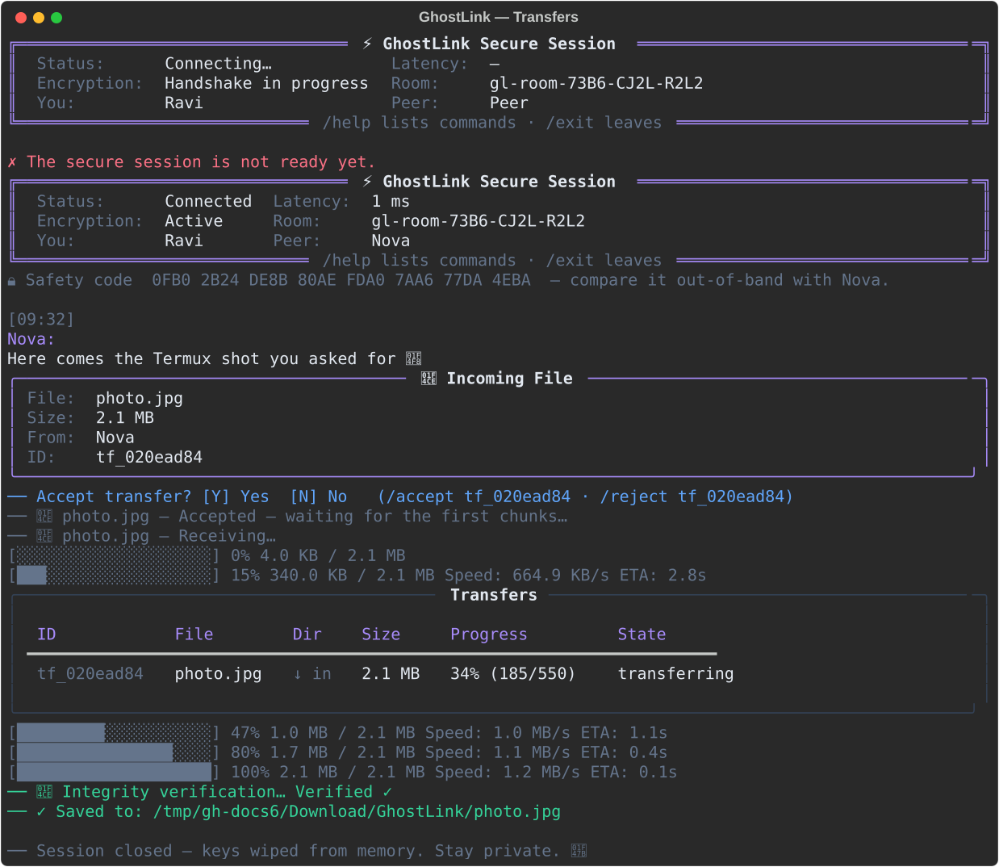
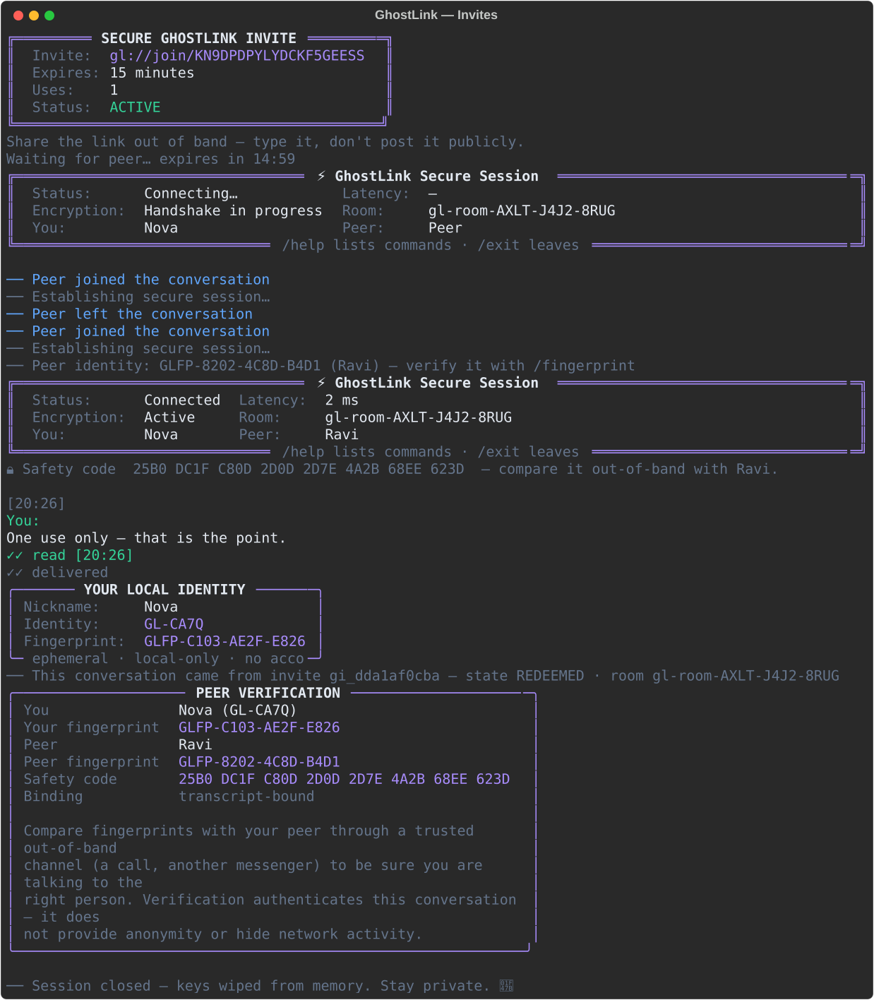

<div align="center">

# 👻 GhostLink

**A terminal-only encrypted messenger — built for Termux, at home on Linux.**

[](https://www.python.org/)
[](https://termux.dev/)
[](docs/ROADMAP.md)
[](LICENSE)
[](https://docs.astral.sh/ruff/)
[](docs/DEVELOPMENT.md)

*Private conversations. Zero compromise.*


</div>

---

## What is GhostLink?

GhostLink is a privacy-first messenger that lives entirely in your terminal —
designed primarily for **Termux on Android**, with first-class support for
**desktop Linux**. No browser, no Electron, no background daemons: one Python
process, one beautiful TUI, and a codebase engineered for the secure
networking phases ahead.

> **Current release: Phase 5 — Ephemeral Identity & One-Time Invites.**
> No accounts, no email, no phone number: every GhostLink user is a local,
> ephemeral Ed25519 identity — a short handle like `GL-7K3M` plus a
> human-verifiable fingerprint like `GLFP-7A92-31CF-88B4`. Two people meet
> through a **secure one-time invite**: `ghostlink invite create` mints a
> `gl://join/<token>` link that the *relay authority* enforces — it expires
> on a monotonic clock, is consumed atomically by exactly one peer, and can
> be revoked by its creator at any time. Inside the encrypted chat, `/fingerprint`
> shows both identity fingerprints to compare out-of-band for stronger
> authentication. See the [roadmap](docs/ROADMAP.md).

## Screenshots

| The secure chat (real scripted session) | A file transfer (real scripted session) |
| :---: | :---: |
|  |  |
|  |  |

All images are generated from the live application by
`scripts/generate_screenshots.py` — what you see is what ships.
`relay.svg` is rendered from a **real probe** against an in-process relay,
`chat.svg` is a **real scripted conversation**, `transfers.svg` a **real
scripted file transfer**, and `invites.svg` a **real invite redemption**
between two identity-bound sessions.

## Feature highlights (Phase 1 — Foundation)

- **Adaptive ASCII branding** — three logo variants chosen by measured
  terminal width, colorised with per-character theme gradients.
- **Automatic environment detection** — platform (Termux / Linux), Python
  runtime, terminal geometry, TTY and color capability.
- **Strict configuration** — TOML, generated on first launch, validated with
  actionable errors; CLI flags outrank file values.
- **Professional logging** — rotating log file with `0600`-class hygiene;
  Rich console echo only in Debug Mode.
- **Interactive menu** — arrow-key navigation on real terminals, automatic
  numbered fallback when piped (CI-friendly).
- **Reusable component library** — panels, tables, status badges, dialogs,
  notification toasts, and progress primitives.
- **Colour theme engine** — `phantom`, `emerald`, `ember`, and `mono` themes
  on a semantic token system (`gl.*`).
- **`ghostlink --doctor`** — read-only environment diagnostics with exit
  codes suitable for scripts.
- **Exception framework** — every failure renders as a clean panel with a
  hint and a deterministic exit code; never a bare traceback.

## Feature highlights (Phase 2 — Secure Networking)

- **Own RFC 6455 WebSocket implementation** — handshakes, masking,
  fragmentation, control-frame rules, and close semantics implemented
  directly over `asyncio` streams. Nothing compiled, Termux-safe.
- **Strictly validated relay protocol (v1)** — `HELLO`, `WELCOME`, `PING`,
  `PONG`, `DISCONNECT`, `ERROR`, `HEARTBEAT` packets in a versioned JSON
  envelope; every packet validated in **both** directions.
- **Connection lifecycle state machine** — `connecting → connected →
  reconnecting → disconnected → closed` with legal-transition enforcement,
  connect/handshake deadlines, and a full history for diagnostics.
- **Automatic reconnection** — exponential backoff with jitter, supervised
  recovery after relay restarts, transport teardown without socket leaks.
- **Heartbeat & latency measurement** — application keepalives plus
  nonce-stamped pings produce real RTT samples, jitter, and a sparkline.
- **Rooms & invites as durable models** — unambiguous room IDs
  (`gl-room-XXXX-XXXX-XXXX`), one-time expiring invite tokens (`gli_…`),
  persisted atomically under `state/`.
- **Live dashboards** — `ghostlink relay-status` probes a relay and renders
  connection, latency, heartbeat, and timeline panels from real data.
- **A real reference relay** — ships with GhostLink:
  `python -m ghostlink.transport.relay.server`.

## Feature highlights (Phase 3 — Secure Messaging)

- **Authenticated end-to-end encryption** — a two-message key exchange
  (ephemeral X25519 + HKDF-SHA256 bound to the handshake transcript, with an
  AEAD key-confirmation proof) derives a **fresh session key per
  conversation**, and a new one after every reconnect. ChaCha20-Poly1305
  seals each message; tampering fails loudly, never silently.
- **Safety codes** — both peers see an identical transcript fingerprint to
  compare out-of-band, ruling out relay-level MITM.
- **Rendezvous channels (relay protocol v2)** — `ATTACH` / `DETACH` /
  `FORWARD` / `PEER` over capacity-two rooms; the relay routes opaque
  ciphertext bodies only and answers with channel-scoped errors.
- **A real message lifecycle** — `queued → sending → sent → delivered →
  read` (plus a loud `failed`), with delivery acknowledgements, coalesced
  read receipts you can switch off, bounded resends, and
  requeue-and-reseal after connection loss.
- **Strict inbound hygiene** — every frame is schema-validated (types,
  sizes, base64/hex, timestamps); ordering is enforced with duplicate
  detection (duplicates are re-acked, never shown twice) and a
  self-healing reorder buffer.
- **Typing indicators** — throttled outbound, expiring inbound, entirely
  content-free, and controlled by a setting.
- **Optional history with three modes** — `disabled` (default) · `session`
  (memory only, wiped on exit) · `encrypted` (passphrase → scrypt → AEAD at
  rest, atomic `0600` writes, wrong passphrase = clear error).
- **Premium terminal chat** — status / encryption / latency banner, wrapped
  message blocks with delivery glyphs, typing and connection notices,
  multi-line composer, arrow-key input history, graceful Ctrl+C, and local
  commands: `/help /info /clear /history /export /exit`.
- **Keys never touch disk** — session keys live in process memory and are
  overwritten before release; logs record ids, sizes and states only, never
  content.

## Feature highlights (Phase 5 — Ephemeral Identity & One-Time Invites)

- **Ephemeral local identities** — a fresh Ed25519 keypair lives on your
  device only (written `0600`, private key never displayed, never in a
  link, never in a log). You get a short handle (`GL-7K3M`) and an
  optional nickname — nothing else. No email, no phone, no real name, no
  permanent account, no social profile.
- **Verification fingerprints** — each identity has a human fingerprint,
  `GLFP-XXXX-XXXX-XXXX`, derived from the public key only. Identity keys
  are bound into the handshake transcript (tampering by anyone — relay
  included — fails the session loudly), and `/fingerprint` inside the
  chat shows both sides to compare over a trusted out-of-band channel for
  stronger authentication.
- **One-time join invites** — `ghostlink invite create --expires 10m`
  mints a 20-character, ~103-bit CSPRNG token (never derived from
  timestamps or counters) and prints a terminal card with
  `gl://join/<token>`. The token is never re-displayed — `invite list`
  and `invite info` show metadata only.
- **Relay-authoritative enforcement** — the relay holds the authoritative
  invite state: expiration on a monotonic clock (immune to local clock
  tampering and timezone drift), an atomic check-and-consume so two peers
  redeeming the *same* invite simultaneously yields exactly one winner,
  creator-only revocation, and fail-closed handling of unknown, expired,
  revoked, or already-used tokens.
- **Session binding** — the invite that created a session is bound to
  that session's id on both sides; a redeemed invite can never start an
  unrelated second session.
- **Terminal-native lifecycle** — `identity show|fingerprint|nickname`,
  `invite create|list|info|revoke`, `join gl://join/<token>`, plus
  `/identity`, `/fingerprint`, `/invite` inside the chat. Invites are
  terminal artefacts: typing the link into a browser does nothing (and
  GhostLink never pretends it does). Terminal records of expired/revoked
  invites are purged on a retention policy.

## Feature highlights (Phase 4 — Secure File Transfer)

- **Peer-approved offers** — `/send photo.jpg` seals a manifest (name,
  size, chunk geometry, SHA-256 — never your local path) and waits; the
  receiver sees an incoming-file panel and answers `[Y]/[N]`. No bytes move
  before approval.
- **Per-transfer encryption** — every transfer derives its own
  HKDF-SHA256 sub-key from the live session key; each chunk is
  ChaCha20-Poly1305-sealed with `transfer_id|chunk_number` as associated
  data. Tampered, truncated, replayed, or mis-numbered chunks are detected
  and rejected — never silently accepted. The relay sees only ciphertext.
- **Sliding-window pump with real ACKs** — bounded in-flight chunks,
  per-chunk acknowledgements, bounded retries, timeouts and backpressure —
  friendly to Termux on modest hardware.
- **Resumable by design** — pause/resume mid-flight; on connection loss
  both sides auto-pause, and after reconnection the receiver's verified-
  chunk bitmap drives the resume: verified chunks are never retransmitted,
  everything is re-sealed under fresh keys.
- **Verify, then publish** — the completed file is SHA-256-checked before
  it becomes visible: success → atomic rename into the download directory
  (`~/Download/GhostLink` by default, `0600` permissions); mismatch →
  FAILED, the partial temp is deleted, and both sides are told loudly.
- **Hostile-name immunity** — remote filenames are sanitized (every
  separator style + unicode lookalikes, control characters, device names,
  length caps); no traversal, no absolute paths, no silent overwrites
  (`name (2).ext` on collision), and the peer can never pick a destination.
- **Live terminal UX** — throttled `bar · % · bytes · speed · ETA`
  progress lines that survive 40-column Termux windows, `/transfers` for a
  live table, `/transfer <id>` for details, and `/accept /reject /pause
  /resume /cancel` with unique id prefixes.
- **Bounded resources** — configurable caps for file size, concurrency,
  chunk size, expiry, retries, and temp quota; offers and transfers expire;
  orphaned temp files are cleaned on startup; history records transfer
  *metadata only* (never contents, never keys).

## Installation

### Termux (Android)

```bash
pkg update && pkg install -y python git
git clone https://github.com/cybervault-Hacky/Ghostlink.git
cd Ghostlink
pip install -r requirements.txt
python ghostlink.py
```

Or use the idempotent bootstrap: `bash scripts/termux_setup.sh`

### Linux

```bash
git clone https://github.com/cybervault-Hacky/Ghostlink.git
cd Ghostlink
python3 -m pip install -r requirements.txt
python3 ghostlink.py
```

### Install as a command

```bash
pip install .          # provides the `ghostlink` command
ghostlink
```

GhostLink requires **Python 3.12+**. Runtime dependencies are minimal —
`rich` and `simple-term-menu` for the interface, `cryptography` for the
audited AEAD/KDF primitives. Nothing to root, nothing left running.

## Usage

```
ghostlink                    Launch the interactive menu

ghostlink host --relay ws://127.0.0.1:8787
                             Create a room, then host the encrypted chat
ghostlink host --name Lounge --lifetime 30 --as Nova
ghostlink join gl-room-… --relay ws://127.0.0.1:8787
                             Join a room's encrypted chat
ghostlink join gl://join/… --relay ws://127.0.0.1:8787
                             Redeem a one-time invite, then chat
ghostlink identity           Show your local identity (handle, fingerprint)
ghostlink identity nickname ShadowUser
                             Set the nickname your peers see
ghostlink invite create --expires 10m --relay ws://127.0.0.1:8787
                             Mint a one-time invite, then host the chat
ghostlink invite create --expires 2s --no-chat --relay …
                             Print the invite card, wait, show EXPIRED
ghostlink invite list        Your invites: state, expiry (`--data-dir` aware)
ghostlink invite info gi_…   Safe metadata for one invite (never the token)
ghostlink invite revoke gi_… Revoke an invite (relay-authoritative)
ghostlink relay-status       Probe the configured relay (live dashboard)
ghostlink relay-status --relay ws://127.0.0.1:8787 --pings 6
ghostlink session            Session overview: history, rooms, invites
ghostlink doctor             Read-only environment diagnostics

ghostlink --theme ember      Launch with a different theme
ghostlink --debug            Debug Mode: verbose logs + console echo
ghostlink --data-dir DIR     Redirect state and logs for this run
ghostlink --config FILE      Use an alternate configuration file
ghostlink --no-color         Plain output (also honours NO_COLOR)
ghostlink --version          Print the version banner
```

**A two-minute conversation.** Terminal one runs a relay and hosts;
terminal two joins:

```bash
# terminal 1
python -m ghostlink.transport.relay.server --port 8787
ghostlink host --relay ws://127.0.0.1:8787 --as Nova
#    → displays the room id, e.g. gl-room-ABCD-EFGH-JKMN, then opens the chat

# terminal 2
ghostlink join gl-room-ABCD-EFGH-JKMN --relay ws://127.0.0.1:8787 --as Ravi
```

Both sides see the safety code — compare it out-of-band once, then type
away. Inside the chat: `\` at line end continues a message,
<b>↑</b> recalls input history, and `/help` lists everything — messaging
(`/info /clear /history /export /exit`), identity
(`/identity /fingerprint /invite`), plus file transfer
(`/send /transfers /transfer /accept /reject /pause /resume /cancel`).

**Meeting via a one-time invite** works like this:

```bash
# terminal 1 (relay already running)
ghostlink invite create --expires 10m --relay ws://127.0.0.1:8787
#    → prints the invite card:
#      ╔══════════════════════════════════╗
#      ║      SECURE GHOSTLINK INVITE      ║
#      ║  Invite: gl://join/8F7K2MQ3…      ║
#      ║  Expires: 10 minutes              ║
#      ║  Uses: 1                          ║
#      ╚══════════════════════════════════╝
#      Waiting for peer… (opens the chat as host)

# terminal 2
ghostlink join gl://join/8F7K2MQ3W2J4X6B9DZP4 --relay ws://127.0.0.1:8787
#    → ✓ Invite accepted — joining the room as guest
```

The relay consumes the invite the instant it is redeemed — a second join
with the same link prints `INVITE ALREADY USED` and exits with code `7`,
whether the attempts arrive seconds apart or at the same moment. When the
deadline passes, the joiner sees `INVITE EXPIRED` (also exit `7`); the
creator can end it early at any time with `ghostlink invite revoke gi_…`.

**Sending a file** works like this:

```
> /send report.pdf
── 📎 report.pdf — Encrypted transfer ready. Waiting for peer approval…
── 📎 report.pdf — Peer accepted.
   [████████████████░░░░] 82% 14.9 / 18.0 MB Speed: 2.8 MB/s ETA: 1.3s
── 📎 Transfer completed ✓
```

The peer sees an *Incoming File* panel, answers `Y` (or `/accept <id>`),
watches the same live bar, and the verified file lands atomically in
`~/Download/GhostLink/`.

Menu navigation: **↑/↓** or **j/k** to move, **Enter** to select, **q** to
quit. When input is piped, the menu becomes a numbered prompt automatically.
Create Room and Join Room in the menu run the same real flows as the CLI —
with a relay configured, they drop straight into the conversation.

Run a local development relay in a second terminal:

```bash
python -m ghostlink.transport.relay.server --host 127.0.0.1 --port 8787
```

## Configuration

Created on first launch at `~/.config/ghostlink/config.toml`:

```toml
[ui]
theme = "phantom"        # phantom | emerald | ember | mono
language = "en"

[notifications]
enabled = true

[storage]
data_dir = ""            # empty = ~/.local/share/ghostlink

[diagnostics]
debug = false

[relay]
url = ""                 # ws://127.0.0.1:8787 or wss://relay.example.org
heartbeat_interval_seconds = 10.0
reconnect_attempts = 3

[rooms]
default_lifetime_minutes = 60

[invites]
default_lifetime_minutes = 15   # Phase 2 room invites
one_time = true
default_expiry_seconds = 900    # gl://join/… invites (relay-enforced)
max_expiry_seconds = 86400      # ceiling for --expires (60..604800)
retention_hours = 24            # keep expired/revoked records this long

[chat]
display_name = ""        # pseudonym for your peer (empty = per-run default)
read_receipts = true     # send ✓✓ read receipts
typing_indicators = true # send typing start/stop signals
history_mode = "disabled"  # disabled | session | encrypted
timestamp_format = "24h"   # 24h → [22:10] · 12h → [10:10 PM]
notification_style = "banner"  # banner | compact | muted
message_wrapping = true    # wrap long messages to the window width

[transfer]
download_dir = ""          # empty = ~/Download/GhostLink
max_file_size_mb = 100     # largest offer you accept, MiB (1..4096)
max_concurrent_transfers = 3
chunk_size_kb = 4          # KiB per sealed chunk (1..4)
ack_timeout_seconds = 5.0  # per-chunk ack wait before resend (0.5..60)
retry_limit = 5            # retries per chunk / offer (1..20)
transfer_expiry_minutes = 60
temp_storage_limit_mb = 1024
```

Unknown keys and invalid values abort launch with precise, hinted errors —
see [docs/CONFIGURATION.md](docs/CONFIGURATION.md).

## Documentation

| Document | Contents |
| --- | --- |
| [docs/ARCHITECTURE.md](docs/ARCHITECTURE.md) | Layers, bootstrap, async model, error taxonomy |
| [docs/CONFIGURATION.md](docs/CONFIGURATION.md) | Every key, location, and precedence rule |
| [docs/DEVELOPMENT.md](docs/DEVELOPMENT.md) | Dev setup, quality gate, contribution patterns |
| [docs/ROADMAP.md](docs/ROADMAP.md) | Phases 1–5 and what is explicitly out of scope |

## Project layout

```
ghostlink/                # the package
├── core/                 # environment, logging, bootstrap, application loop
├── cli/                  # argument parsing, commands/ (host, join, …), entrypoint
├── messaging/            # Phase 3: secure one-to-one messaging
│   ├── protocol/         #   key exchange + AEAD primitives (memory-only keys)
│   ├── packets/          #   validated secure-channel frames (chat + FILE_*)
│   ├── models/           #   message model + delivery lifecycle
│   ├── queue/            #   outbox pump queue + inbox ordering/dedup
│   ├── session/          #   ChatSession orchestrator + events (identity-bound)
│   └── history.py · receipts.py · typing.py
├── identity/             # Phase 5: ephemeral Ed25519 identity (GL-… handle,
│                         #   GLFP-… fingerprint, 0600 storage, lifecycle)
├── invites/              # Phase 5: one-time join invites — tokens, models,
│                         #   relay authority, registry, redemption, panels
├── transfer/             # Phase 4: secure encrypted file transfer
│   ├── manager.py        #   offers, send pump, resume, expiry, history
│   ├── models.py         #   transfer lifecycle state machine + snapshots
│   ├── manifest.py       #   sealed, cross-validated file metadata
│   ├── chunking.py       #   streaming chunk I/O + resume bitmaps
│   ├── integrity.py      #   per-transfer HKDF keys + AEAD chunks + SHA-256
│   ├── storage.py        #   sanitized destinations + temp hygiene + quota
│   ├── packets.py · cleanup.py · progress.py
├── transport/            # Transport ABC, connection state machine, heartbeat,
│   │                     # sessions with expiry + sweeper
│   ├── websocket/        # own RFC 6455 framing + WebSocket transport
│   └── relay/            # packet protocol v3 (channels + invite authority)
│                         # endpoint · client · server
├── ui/                   # console, themes, banner, menu, chat surface,
│                         # components/, screens/, dashboards, charts, gradients
├── config/               # TOML loader, validation, manager
├── storage/              # backend contract, atomic JSON, memory, manager
├── services/             # DI container, session lifecycle, rooms & invites
├── models/               # frozen data models (environment, room, invite, …)
├── exceptions/           # GhostLinkError hierarchy + renderer (network exit 6)
├── constants/            # metadata & file/env names (single source of truth)
├── utils/                # XDG paths, text helpers
└── assets/               # ASCII branding, packaged default config
docs/ tests/ scripts/     # documentation · pytest suite (992 tests) · tooling
```

## Security posture in Phase 5

- **End-to-end encryption is on for every chat and every file** — ephemeral
  X25519 ECDH + HKDF-SHA256 derives a fresh session key per conversation
  (fresh again on every reconnect); ChaCha20-Poly1305 authenticates each
  message and each chunk. The relay forwards ciphertext it cannot read.
- **Files get per-transfer keys** — HKDF sub-keys of the live session key,
  domain-separated by transfer id; chunk ciphertexts are bound to
  `transfer_id|chunk_number` as AEAD associated data, so tampering,
  truncation, replay and reordering are detected, never accepted.
- **MITM check is human** — an AEAD key-confirmation proof catches protocol
  mismatch automatically; the shared **safety code** and each side's
  **identity fingerprint** (`GLFP-…`, bound into the handshake transcript)
  catch a malicious relay when compared out-of-band. Fingerprint
  comparison strengthens *authentication* — it is not an anonymity
  mechanism (see *Privacy limitations* below).
- **Invites are authority-enforced, not convention-enforced** — expiry
  runs on the relay's monotonic clock, single redemption is an atomic
  state transition with no await between check and consume, revocation is
  creator-only, and every edge case (1s TTLs, redemption exactly at the
  deadline, replayed tokens) fails closed. Invite tokens are ~103 bits of
  CSPRNG output — unguessable, non-sequential, never timestamp-derived;
  logs and `invite list` only ever show the public `gi_…` id.
- **Verify before publish** — received files are SHA-256-verified against
  the sealed manifest and appear in the download directory only after
  passing, via atomic rename (never a visible partial file).
- **Names are hostile input** — remote filenames are sanitized before they
  touch any path; destinations always resolve inside the GhostLink download
  directory, collision-proof, and no peer can ever choose one.
- **Keys never touch disk** — session and transfer keys live only in
  process memory and are overwritten before release; history is off by
  default, records transfer *metadata only* (name, size, direction, status,
  id), and encrypted-history mode keeps it behind a passphrase
  (scrypt → AEAD, atomic `0600` writes). The identity's private key is
  stored `0600` on your device only — never displayed, never in a link,
  never in chat, never in a log.
- **Privacy limitations, stated plainly** — GhostLink minimizes
  *application-level* identity and metadata: no accounts, no email, no
  phone, no real name, no server-side profiles. It does **not** make you
  untraceable or anonymous: whoever runs your relay (and your network
  provider) can see connection metadata, including IP addresses. If that
  matters to you, run your own relay and use `wss://`; network-level
  visibility is out of scope for GhostLink's design.
- **Logs are content-free** — ids, sizes, chunk numbers, and states only;
  plaintext, ciphertext, filenames and keys are never logged.
- **Transport still matters** — choose `wss://` relay URLs for anything
  beyond local development; E2E protects content either way.
- Rooms and invites are stored atomically with owner-only (`0600`)
  permissions; invite tokens hold 192 bits of entropy.
- Session IDs, packet IDs, nonces, message IDs, and transfer IDs come from
  `secrets`; keys and salts from the `cryptography` package.
- Nothing is collected, beaconed, or phoned home — the only endpoint ever
  contacted is a relay **you** configured or passed on the command line.

## Contributing

1. Fork, then branch from `main`.
2. `pip install -e ".[dev]"` and keep `scripts/dev_check.sh` green.
3. Follow the patterns in [docs/DEVELOPMENT.md](docs/DEVELOPMENT.md):
   typed signatures, `GhostLinkError` for failures, components for UI.

## License

[MIT](LICENSE) © 2026 cybervault-Hacky
