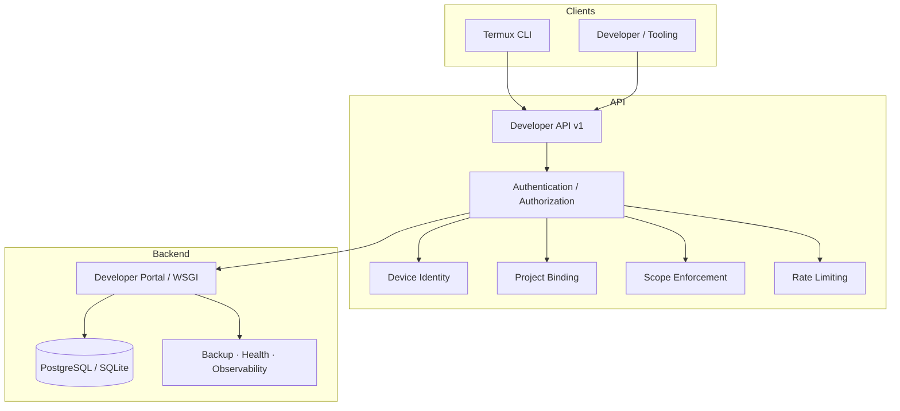

# GhostLink

> A secure, developer-first platform for controlled device connectivity, scoped
> developer APIs, Termux integration, and production-grade operations — built on
> a terminal-only, encrypted messaging foundation.

**Version:** `0.17.0` · **Phase:** 15 — Production Operations & Platform Maturity · **Status:** Final Development Release

---

## Badges

| | |
|---|---|
| **Python** | `>= 3.11` |
| **Frontend** | React · Vite · Vitest |
| **Database** | SQLite (dev) · PostgreSQL (production) |
| **License** | MIT |

> Badges for third-party services (CI, coverage, download counts) are omitted
> because those services are not actively connected in this environment. This
> is intentional — nothing here is claimed that is not verified.

---

## What is GhostLink?

GhostLink is a **terminal-only encrypted messenger** designed for **Termux on
Android** and **desktop Linux**, extended with a **production-grade developer
platform**: a scoped, authenticated, revocable **Developer API v1**, a
**Termux-friendly developer CLI**, device identity, project binding, credential
lifecycle, and a full operations layer (PostgreSQL backend, migrations,
encrypted backups, health/readiness, structured observability, and fail-closed
production configuration).

It exists to give developers a **controlled, least-privilege way** to connect
their Termux/device tooling to a backend they own, without exposing permanent
secrets or weakening the security model of the underlying messenger.

**Clearly separated components:**

- **Messenger core** — the terminal-only encrypted chat (rooms, groups,
  file transfer, ephemeral identity, one-time invites, relay).
- **Developer Portal** (`portal/`) — the web console (white-first, Apple-inspired
  glassmorphism UI) plus the backend that owns identity and credentials.
- **Developer API** (`/api/v1/developer/*`) — the scoped, authenticated API.
- **Termux CLI** — `ghostlink developer …` plus operational commands.
- **Security & operations layer** — the Owner boundary, rate limiting, secret
  scrubbing, backups, health checks, and release tooling.

---

## Key Features

### Developer Platform
- Versioned Developer API (`/api/v1/developer/*`)
- Scoped credentials (least-privilege scope set)
- Project binding and project isolation
- Device identity and device management
- API activity (metadata-only) and security events
- Access/refresh token rotation and credential revocation

### Security
- Short-lived access tokens (15 min) and rotating refresh tokens (single-use)
- Hashed token/secret storage (never plaintext)
- Server-side scope, device, and project binding
- Distributed rate limiting (in-memory + PostgreSQL), fail-closed in production
- CSRF protection, session revocation, password-change session invalidation
- Security-event severity model (INFO → CRITICAL) and secret scrubbing
- **Single-Owner boundary** (see [Security Model](#security-model))

### Termux
- `developer login / logout / whoami / device / project / credential /
  security-status / doctor`
- Fail-closed on network failures and malformed responses
- Secure local token store (0600/0700, atomic, symlink-refusing)

### Infrastructure
- PostgreSQL adapter + SQLite development backend
- Numbered, checksummed migrations with advisory-lock serialisation
- Transactions, connection pooling, timeouts, future-schema rejection
- Health/liveness/readiness endpoints
- Encrypted, checksummed backups and a deterministic disaster-recovery drill

### Operations
- Structured JSON logging with request correlation and secret scrubbing
- `ghostlink production check` (PASS/WARN/FAIL readiness)
- `ghostlink release check | verify | manifest` (fail-closed release gates)
- Docker, nginx, systemd, and PostgreSQL deployment artifacts
- Gunicorn WSGI entrypoint for production

---

## Architecture



> This is a conceptual diagram. GhostLink does not invent services or
> integrations beyond what is implemented in the repository.

---

## Security Model

This is the strongest part of the product. Every claim below is enforced by
automated tests.

### Authentication

- **Access tokens** — short-lived (15 minutes), issued only through the pairing
  flow, sent via `Authorization: Bearer`.
- **Refresh tokens** — long-lived (30 days) but **single-use**: each refresh
  rotates the token, so a replayed refresh token **fails closed**.
- **Revocation** — revoking a credential or device invalidates its tokens;
  revoked credentials can never mint new tokens.
- **Sessions** — absolute + idle expiry, CSRF-protected, revocable; password
  changes revoke all sessions.

### Authorization

Authorization is **derived server-side** from the authenticated identity, never
from client-supplied ownership fields.

```
credential → developer → project → device → scope
```

Each request is bound to a scoped credential, a project, and (where relevant) a
device. Least privilege is enforced on every endpoint.

### Device Identity

GhostLink uses a **cryptographically random device identity** issued at pairing
time. It deliberately **does not** collect or rely on:

- IMEI, SIM data, contacts, precise location, biometrics, or other unnecessary
  Android identifiers.

### Owner Boundary

**GhostLink has exactly one Owner.** This is a permanent, non-negotiable
invariant.

- Developer accounts **cannot become Owner**.
- Developer accounts **cannot transfer ownership**.
- There is **no** `owner:*`, `root:*`, or `admin:*` scope available to developer
  accounts.
- The Owner cannot be created, duplicated, escalated to, or deleted through any
  developer API, CLI command, database migration, backup restore, or pairing
  path.

`TestSingleOwnerInvariant` is a dedicated regression suite that enforces this
permanently.

### Scope Security

Developer credentials carry a **least-privilege scope set**. Privileged
owner/root/admin scopes are not available. Requested scopes are validated
server-side; unknown or privileged scopes are rejected.

---

## Developer API

Namespace: `/api/v1/developer/*`

| Method | Endpoint | Scope |
|---|---|---|
| POST | `/api/v1/developer/auth/pair-begin` | — |
| POST | `/api/v1/developer/auth/pair-approve` | — |
| POST | `/api/v1/developer/auth/token` | — |
| POST | `/api/v1/developer/auth/refresh` | — |
| GET | `/api/v1/developer/devices` | `device:read` |
| POST | `/api/v1/developer/devices/{device_id}/revoke` | `device:write` |
| GET | `/api/v1/developer/projects` | `project:read` |
| GET | `/api/v1/developer/credentials` | `credential:read` |
| POST | `/api/v1/developer/credentials/{credential_id}/rotate` | `credential:rotate` |
| POST | `/api/v1/developer/credentials/{credential_id}/revoke` | `credential:read` |
| GET | `/api/v1/developer/security/activity` | `security:read` |
| GET | `/api/v1/developer/health` | — |

**Authentication:** `Authorization: Bearer YOUR_ACCESS_TOKEN`

**Error envelope:**

```json
{ "error": { "code": "unauthorized", "message": "…" } }
```

**Behavior:** scoped access, project + device binding, rate limiting, request
size limits, malformed-JSON fail-closed, and IDOR resistance. Replay and
expired/revoked tokens are rejected.

> The endpoint set above is machine-verified against the live router by the API
> contract tests (`test_api_contract.py`).

---

## Developer Quick Start

The fastest way to get started developing with GhostLink:

```bash
# 1. Start the local developer environment (backend + portal)
ghostlink developer start

# 2. Open the portal URL shown in the terminal (e.g. http://127.0.0.1:5173)
#    Sign in, and click "Connect this device"

# 3. Pair your Termux installation using the displayed pairing code / QR
ghostlink developer pair GL-XXXX-YYYY

# 4. Your environment is ready! Run developer commands:
ghostlink developer whoami
ghostlink developer device list
ghostlink developer project list
ghostlink developer doctor
```

## Termux Integration

GhostLink ships a full developer CLI. Run `ghostlink developer` for the interactive developer command center.

```bash
ghostlink developer start                  # start local backend & frontend
ghostlink developer stop                   # stop running developer servers
ghostlink developer status                 # show real-time environment status
ghostlink developer portal                 # open Developer Portal in browser
ghostlink developer pair [CODE]            # pair Termux device via short-lived code
ghostlink developer whoami                 # show developer identity & scopes
ghostlink developer device list            # list registered devices
ghostlink developer device revoke <id>     # revoke a device
ghostlink developer project list           # list developer projects
ghostlink developer credential status      # view scoped credential metadata
ghostlink developer security-status        # view recent developer security events
ghostlink developer doctor                 # run comprehensive diagnostics
ghostlink developer logout                 # clear local tokens
```

Operational commands available on a host with the portal backend:

```bash
ghostlink production check
ghostlink release check
ghostlink release verify
ghostlink release manifest
```

**Local token storage:** the CLI stores access/refresh tokens in a local store
with restrictive file permissions (0600/0700), atomic writes, symlink refusal,
schema versioning, and corruption detection. It never stores the permanent API
credential after one-time issuance.

**Failure handling:** network failures, DNS/timeouts, and malformed or partial
2xx responses **fail closed** — they are never treated as successful
authentication. HTTP 401/403/429/500/503 produce clear, safe, actionable errors.

---

## Database

### Development — SQLite
The default backend for local development, tests, and Termux: a thread-safe
SQLite adapter with foreign keys enabled and transactional migrations.

### Production — PostgreSQL
A first-class `psycopg3` + `psycopg_pool` adapter with:

- connection pooling (min/max, connect/statement/idle timeouts)
- numbered, **checksummed** migrations with advisory-lock serialisation
- future-schema and corrupted-checksum **rejection** (fail closed)
- transaction rollback and concurrent-write safety
- PostgreSQL-persisted distributed rate limiting

**Verification status:** the SQLite adapter and the PostgreSQL adapter logic are
tested. **PostgreSQL runtime integration is environment-gated** — it must be
verified against a real PostgreSQL instance before production deployment (the
CI `postgres-integration` job runs it). This limitation is not hidden.

---

## Backup & Disaster Recovery

```bash
ghostlink backup create
ghostlink backup verify
ghostlink backup list
ghostlink backup restore   # dry-run by default; --apply only into an isolated DB
```

- Encrypted (authenticated ChaCha20-Poly1305) and checksum-verified backups
- Manifest with schema version, timestamp, and checksum
- Restore into an **isolated/fresh database** only; never automatic or
  destructive
- **Critical invariant:** restore never reactivates revoked credentials or
  sessions, and never creates an Owner — enforced by the deterministic DR drill
  (`test_dr_drill.py`).

Recovery assumptions: the backup key (when encryption is enabled) is required to
verify/decrypt; a restore is never a substitute for verifying backups.

---

## Production Deployment

Available deployment artifacts:

| Artifact | Path |
|---|---|
| Dockerfile (prod) | `deployment/docker/Dockerfile` |
| Dockerfile (dev) | `deployment/docker/Dockerfile.dev` |
| Docker Compose (dev) | `deployment/docker/docker-compose.yml` |
| Docker Compose (prod overlay) | `deployment/docker/docker-compose.prod.yml` |
| Nginx reverse proxy | `deployment/nginx/ghostlink.conf` |
| systemd unit | `deployment/systemd/ghostlink.service` |
| PostgreSQL notes | `deployment/postgres/README.md` |
| Environment templates | `deployment/env/*.example` |

**Architecture:**

```
Internet → HTTPS (nginx) → Gunicorn → GhostLink WSGI app → PostgreSQL
```

Production runs the WSGI app under **gunicorn** (never the dev server), as a
non-root user, with a read-only filesystem, dropped capabilities, and a
healthcheck.

> **Public production deployment has not been performed from this development
> environment.** Deployment artifacts are implemented and statically verified;
> Docker runtime and PostgreSQL runtime verification are environment-gated.

---

## Configuration

GhostLink supports three environments: `development`, `staging`, `production`.

**Production is fail-closed.** It rejects:
- SQLite as the production database
- in-memory rate limiting
- insecure cookies (`PORTAL_SECURE_COOKIES=false`)
- wildcard `ALLOWED_HOSTS`
- the development session secret
- development email configuration
- a non-HTTPS `PUBLIC_BASE_URL`
- missing required production secrets

Configuration categories include: database (`DATABASE_URL`, `DB_POOL_*`,
`DB_*_TIMEOUT`), rate limiting (`RATE_LIMIT_BACKEND`), sessions, cookies, hosts
(`ALLOWED_HOSTS`, `TRUSTED_PROXIES`), SMTP, public URL, proxy trust, backup
encryption (`BACKUP_ENCRYPTION_KEY`), and connection pools.

Use the `.example` templates in `deployment/env/`. **Never commit a real `.env`.**

---

## Observability

- Structured JSON logging (or text) with a **safe metadata allow-list**
- Request correlation (`X-Request-ID`)
- Lifecycle events (startup, shutdown, migration, backup)
- Security-event severity (`INFO` → `CRITICAL`) and categories
- Defensive **secret scrubbing** of secret-shaped values in free-form text
- Health endpoints:

| Endpoint | Purpose |
|---|---|
| `GET /health/live` | Process is alive (no DB dependency) |
| `GET /health/ready` | DB connectivity + migrations + required production config |
| `GET /health` | Safe operational summary |

Logs never contain passwords, tokens, credentials, pairing codes, session
secrets, database/SMTP passwords, encryption keys, or raw Authorization headers.

---

## Frontend

The Developer Portal (`portal/web`) is a **white-first, Apple-inspired, premium
glassmorphism** interface with a subtle antigravity particle background,
restrained indigo accent, and strong accessibility.

Verified qualities:
- Loading, empty, and error states on async pages with retry actions
- Accessibility roles (`role=status`, `role=alert`), keyboard navigation,
  visible focus, reduced-motion support
- **No tokens in `localStorage`/`sessionStorage`** — session cookies only
- Production build (`npm run build`) and tests (`npm test`)

Pages: Landing, Dashboard, Developer API, Devices, Credentials, Projects,
Sessions, Security, Activity, API Activity, Settings, Sign In / Sign Up /
Verify.

---

## CLI

| Command | Purpose |
|---|---|
| `host` / `join` / `invite` / `group` | Encrypted rooms, groups, and one-time invites |
| `identity` | Local ephemeral identity |
| `relay-status` / `session` | Network / session dashboards |
| `doctor` / `security-status` | Environment & security diagnostics |
| `developer` | Developer-API operations (Termux) |
| `production check` | Production readiness validation |
| `release check / verify / manifest` | Release verification |
| `backup create / verify / list / restore` | Backup & disaster recovery |
| `db status / migrate / verify` | Database operations |
| `system health / readiness` | Operational probes |
| `security-audit` | Offline deterministic security audit |

---

## Project Structure

```
ghostlink/               # CLI / messenger core (terminal-only)
├── ghostlink/           #   package (messaging, groups, transfer, transport, CLI)
├── portal/              # Developer Portal
│   ├── backend/         #   WSGI backend, database, ops
│   └── web/             #   React frontend
├── deployment/          # Docker, nginx, systemd, PostgreSQL, env templates
├── docs/                # Security, operations, runbook, API, recovery docs
├── scripts/             # dev/security/release gates, secret scan, docker check
├── tests/               # Python test suite
├── pyproject.toml       # packaging + tool config
├── CHANGELOG.md
├── LICENSE              # MIT
└── README.md
```

---

## Installation

**Requirements**

- Python `>= 3.11`
- Node.js + npm (for the portal frontend)
- Optional: PostgreSQL (production), Docker (container runtime)

**Clone**

```bash
git clone https://github.com/cybervault-Hacky/Ghostlink.git
cd Ghostlink
```

**Python environment**

```bash
python3 -m venv .venv
source .venv/bin/activate
pip install -e ".[dev]"
```

**Frontend**

```bash
cd portal/web
npm install
cd ../..
```

---

## Local Development

```bash
# 1. environment
python3 -m venv .venv && source .venv/bin/activate
pip install -e ".[dev]"

# 2. frontend deps
(cd portal/web && npm install)

# 3. configuration
cp deployment/env/.env.development.example .env   # dev defaults

# 4. database + migrations (SQLite dev backend)
python -m ghostlink db migrate

# 5. backend (dev WSGI server)
python -m portal_server --db portal.db

# 6. frontend dev server
cd portal/web && npm run dev
```

> Development mode uses the safe dev defaults (SQLite, in-memory rate limiter,
> dev email adapter). Production uses the fail-closed environment.

---

## Testing

```bash
pytest
scripts/dev_check.sh
scripts/security_check.sh
scripts/release_check.sh
scripts/scan_secrets.py
scripts/docker_check.py
```

Frontend:

```bash
cd portal/web
npm test
npm run build
```

The final release (0.17.0) test suite records **1733 passed, 13 skipped**; the
13 skips are environment-gated PostgreSQL runtime tests (no live server in this
environment). For the authoritative current count, run `pytest` locally.

---

## Release Process

```bash
ghostlink production check    # PASS/WARN/FAIL readiness; non-zero on mandatory failure
ghostlink release check       # deterministic release gates
ghostlink release verify      # same, non-zero on failure
ghostlink release manifest    # machine-readable release manifest
```

Releases are **fail-closed**: version mismatch, dirty tree, secrets, failed
security audit, failed tests, failed frontend build, failed package build, or
invalid migration checksum all block the release. The manifest reports version,
phase, commit SHA, build timestamp, Python version, package/frontend/migration
versions, dependency-lock state, security-check state, test count, and build
state.

**A release command never deploys anything automatically.**

---

## CI/CD

Workflow definitions exist for `test`, `security`, `build`, and `release` in
`.github/workflows/`. They cover unit + integration tests, a PostgreSQL service,
ruff, mypy, compileall, frontend tests + build, secret scan, security audit,
package build + wheel inspection, and migration verification. The release
workflow requires explicit approval and never deploys automatically.

> **Status:** the workflow files cannot currently be pushed to the remote
> because the connected GitHub App token lacks the `workflows` permission
> (GitHub refuses to create/update workflow files without it). **CI is not
> running remotely in this environment.** The files are preserved locally and
> the offline quality gates are the deterministic verification path here.

---

## Production Readiness

| Area | Status |
|---|---|
| Authentication | Verified |
| Authorization | Verified |
| Owner invariant | Verified |
| Rate limiting | Verified |
| Secret scanning | Verified |
| Database migrations | Verified |
| PostgreSQL adapter | Implemented |
| PostgreSQL runtime | **Environment-gated** |
| Docker | Static verified |
| Docker runtime | **Environment-gated** |
| HTTPS | Configured / documented |
| Public deployment | **Not performed** |
| Backup / restore | Verified |
| Termux CLI | Verified |
| Frontend build | Verified |
| CI/CD | Environment / permission dependent |

---

## Development Roadmap

GhostLink shipped in 15 deliberate phases:

| Phase | Focus |
|---|---|
| 1 | Foundation |
| 2 | Secure Networking |
| 3 | Secure Messaging |
| 4 | Secure File Transfer |
| 5 | Ephemeral Identity & One-Time Invites |
| 6A–6D | Group Security, Lifecycle, Messaging, Rich Communication |
| 7 | Sender-Key Hardening |
| 8 | Reliability & Adversarial Validation |
| 9 | Production Readiness & Release Engineering |
| 10A–10B | Developer Accounts & Developer Portal |
| 11 | Production Portal Hardening & Launch Readiness |
| 12 | Developer API Platform & Termux Integration |
| 13 | Production Infrastructure, Database & Deployment Hardening |
| 14 | Public Production Launch & Reliability |
| 15 | **Production Operations & Platform Maturity** |

### Final Development Status

**GhostLink development is complete through Phase 15.**

Phase 15 is the **final planned development phase**. **There is intentionally no
Phase 16.** Future repository activity is maintenance-only:

- security patches
- bug fixes
- dependency updates
- compatibility and performance fixes
- operational improvements
- documentation corrections

These are maintenance work, **not** new numbered development phases.

---

## Known Limitations

- **Public deployment:** not performed from this development environment.
- **PostgreSQL runtime:** environment-gated; must be verified against a real
  instance before production deployment.
- **Docker / nginx runtime:** not executed here; artifacts are statically
  validated.
- **GitHub workflow delivery:** blocked by GitHub App `workflows` permission.
- **Dependency advisories:** `npm audit` flags `react-router <7` and `vite <8`;
  both require breaking major upgrades and are non-exploitable in this
  deployment model (client-side SPA with no SSR; vite is build-time). Assessed
  and documented in `docs/DEPENDENCIES.md`; not claimed as fixed.
- **No automatic destructive rollback** — by design.

---

## Security Policy

GhostLink takes security seriously. If you discover a security issue:

- **Do not** publicly exploit or disclose it in a way that harms users.
- **Do not** publish credentials, tokens, or private material.
- Report responsibly by contacting the maintainers through the repository's
  available security/issue mechanism.

See [docs/SECURITY.md](docs/SECURITY.md) for the security model and
[docs/INCIDENT_RESPONSE.md](docs/INCIDENT_RESPONSE.md) for operational incident
procedures.

---

## Contributing

1. Fork the repository and create a feature branch.
2. Make your changes.
3. Run the quality gates: `pytest`, `ruff`, `mypy --strict`, `compileall`,
   `scripts/security_check.sh`, and the frontend `npm test` + `npm run build`.
4. Open a pull request.

Security-sensitive changes (authentication, authorization, the Owner boundary,
crypto, secret handling) require extra review and must not weaken existing
controls.

---

## License

Licensed under the **MIT License**. See the [LICENSE](LICENSE) file for details.

---

## Final Status

- **Version:** 0.17.0
- **Final phase:** 15 — Production Operations & Platform Maturity
- **Development roadmap:** complete through Phase 15 (no Phase 16)
- **Public production deployment:** not performed
- **Maintenance mode:** active for security patches, bug fixes, and dependency
  updates

GhostLink is released as a final, frozen development product. It is **not**
claimed to be "100% secure," "unhackable," or "production-deployed" — those are
not true, and this project does not make such claims.
