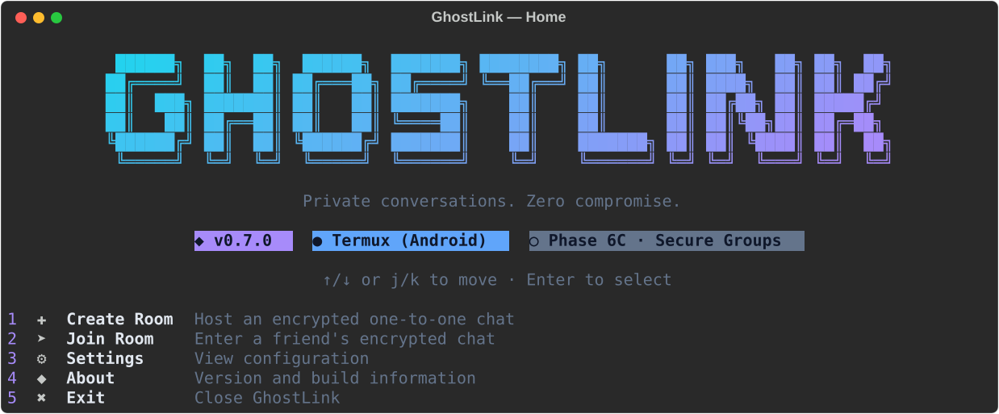
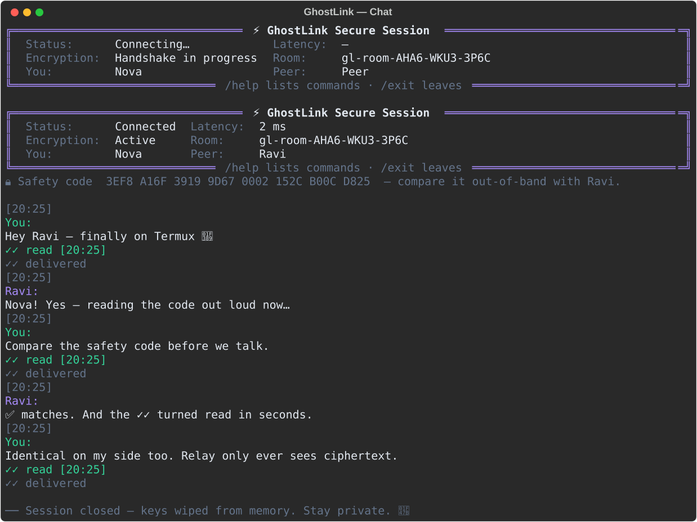
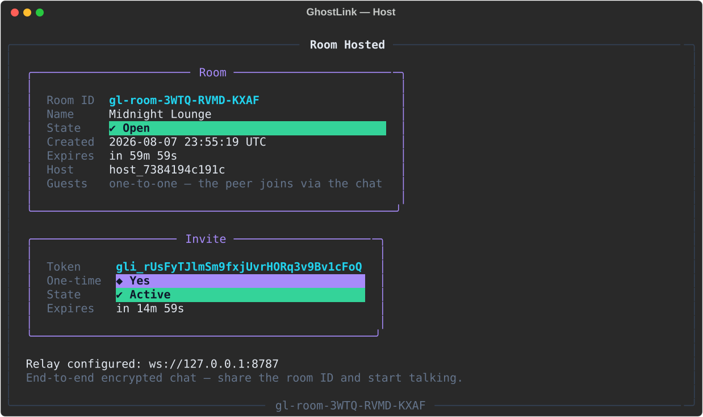
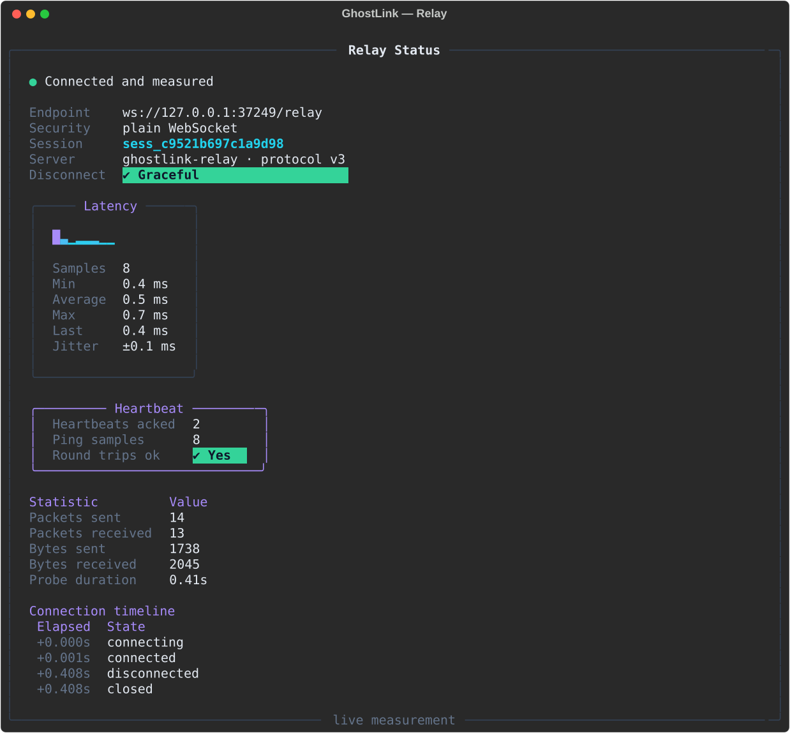
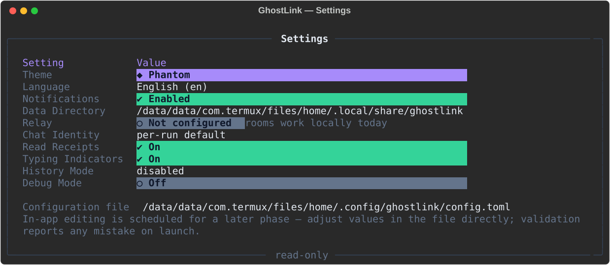

<div align="center">

# 👻 GhostLink

**A terminal-only encrypted messenger — built for Termux, at home on Linux.**

[](https://www.python.org/)
[](https://termux.dev/)
[](docs/ROADMAP.md)
[](LICENSE)
[](https://docs.astral.sh/ruff/)
[](docs/DEVELOPMENT.md)

*Private conversations. Zero compromise.*



</div>

---

## What is GhostLink?

GhostLink is a privacy-first messenger that lives entirely in your terminal —
designed primarily for **Termux on Android**, with first-class support for
**desktop Linux**. No browser, no Electron, no background daemons: one Python
process, one beautiful TUI, and a codebase engineered for the secure
networking phases ahead.

> **Current release: Phase 3 — Secure Messaging.**
> Two people can now open a room and chat, end-to-end encrypted, entirely in
> the terminal: an authenticated X25519 handshake fresh per conversation,
> ChaCha20-Poly1305 per message, delivery and read receipts, typing
> indicators, reconnection with transparent re-keying, and optional
> passphrase-locked history. The relay only ever forwards ciphertext.
> See the [roadmap](docs/ROADMAP.md).

## Screenshots

| The secure chat (real scripted session) | Hosting a room |
| :---: | :---: |
|  |  |
|  |  |

All images are generated from the live application by
`scripts/generate_screenshots.py` — what you see is what ships.
`relay.svg` is rendered from a **real probe** against an in-process relay,
and `chat.svg` is a **real scripted conversation** between two sessions.

## Feature highlights (Phase 1 — Foundation)

- **Adaptive ASCII branding** — three logo variants chosen by measured
  terminal width, colorised with per-character theme gradients.
- **Automatic environment detection** — platform (Termux / Linux), Python
  runtime, terminal geometry, TTY and color capability.
- **Strict configuration** — TOML, generated on first launch, validated with
  actionable errors; CLI flags outrank file values.
- **Professional logging** — rotating log file with `0600`-class hygiene;
  Rich console echo only in Debug Mode.
- **Interactive menu** — arrow-key navigation on real terminals, automatic
  numbered fallback when piped (CI-friendly).
- **Reusable component library** — panels, tables, status badges, dialogs,
  notification toasts, and progress primitives.
- **Colour theme engine** — `phantom`, `emerald`, `ember`, and `mono` themes
  on a semantic token system (`gl.*`).
- **`ghostlink --doctor`** — read-only environment diagnostics with exit
  codes suitable for scripts.
- **Exception framework** — every failure renders as a clean panel with a
  hint and a deterministic exit code; never a bare traceback.

## Feature highlights (Phase 2 — Secure Networking)

- **Own RFC 6455 WebSocket implementation** — handshakes, masking,
  fragmentation, control-frame rules, and close semantics implemented
  directly over `asyncio` streams. Nothing compiled, Termux-safe.
- **Strictly validated relay protocol (v1)** — `HELLO`, `WELCOME`, `PING`,
  `PONG`, `DISCONNECT`, `ERROR`, `HEARTBEAT` packets in a versioned JSON
  envelope; every packet validated in **both** directions.
- **Connection lifecycle state machine** — `connecting → connected →
  reconnecting → disconnected → closed` with legal-transition enforcement,
  connect/handshake deadlines, and a full history for diagnostics.
- **Automatic reconnection** — exponential backoff with jitter, supervised
  recovery after relay restarts, transport teardown without socket leaks.
- **Heartbeat & latency measurement** — application keepalives plus
  nonce-stamped pings produce real RTT samples, jitter, and a sparkline.
- **Rooms & invites as durable models** — unambiguous room IDs
  (`gl-room-XXXX-XXXX-XXXX`), one-time expiring invite tokens (`gli_…`),
  persisted atomically under `state/`.
- **Live dashboards** — `ghostlink relay-status` probes a relay and renders
  connection, latency, heartbeat, and timeline panels from real data.
- **A real reference relay** — ships with GhostLink:
  `python -m ghostlink.transport.relay.server`.

## Feature highlights (Phase 3 — Secure Messaging)

- **Authenticated end-to-end encryption** — a two-message key exchange
  (ephemeral X25519 + HKDF-SHA256 bound to the handshake transcript, with an
  AEAD key-confirmation proof) derives a **fresh session key per
  conversation**, and a new one after every reconnect. ChaCha20-Poly1305
  seals each message; tampering fails loudly, never silently.
- **Safety codes** — both peers see an identical transcript fingerprint to
  compare out-of-band, ruling out relay-level MITM.
- **Rendezvous channels (relay protocol v2)** — `ATTACH` / `DETACH` /
  `FORWARD` / `PEER` over capacity-two rooms; the relay routes opaque
  ciphertext bodies only and answers with channel-scoped errors.
- **A real message lifecycle** — `queued → sending → sent → delivered →
  read` (plus a loud `failed`), with delivery acknowledgements, coalesced
  read receipts you can switch off, bounded resends, and
  requeue-and-reseal after connection loss.
- **Strict inbound hygiene** — every frame is schema-validated (types,
  sizes, base64/hex, timestamps); ordering is enforced with duplicate
  detection (duplicates are re-acked, never shown twice) and a
  self-healing reorder buffer.
- **Typing indicators** — throttled outbound, expiring inbound, entirely
  content-free, and controlled by a setting.
- **Optional history with three modes** — `disabled` (default) · `session`
  (memory only, wiped on exit) · `encrypted` (passphrase → scrypt → AEAD at
  rest, atomic `0600` writes, wrong passphrase = clear error).
- **Premium terminal chat** — status / encryption / latency banner, wrapped
  message blocks with delivery glyphs, typing and connection notices,
  multi-line composer, arrow-key input history, graceful Ctrl+C, and local
  commands: `/help /info /clear /history /export /exit`.
- **Keys never touch disk** — session keys live in process memory and are
  overwritten before release; logs record ids, sizes and states only, never
  content.

## Installation

### Termux (Android)

```bash
pkg update && pkg install -y python git
git clone https://github.com/cybervault-Hacky/Ghostlink.git
cd Ghostlink
pip install -r requirements.txt
python ghostlink.py
```

Or use the idempotent bootstrap: `bash scripts/termux_setup.sh`

### Linux

```bash
git clone https://github.com/cybervault-Hacky/Ghostlink.git
cd Ghostlink
python3 -m pip install -r requirements.txt
python3 ghostlink.py
```

### Install as a command

```bash
pip install .          # provides the `ghostlink` command
ghostlink
```

GhostLink requires **Python 3.12+**. Runtime dependencies are minimal —
`rich` and `simple-term-menu` for the interface, `cryptography` for the
audited AEAD/KDF primitives. Nothing to root, nothing left running.

## Usage

```
ghostlink                    Launch the interactive menu

ghostlink host --relay ws://127.0.0.1:8787
                             Create a room, then host the encrypted chat
ghostlink host --name Lounge --lifetime 30 --as Nova
ghostlink join gl-room-… --relay ws://127.0.0.1:8787
                             Join a room's encrypted chat
ghostlink relay-status       Probe the configured relay (live dashboard)
ghostlink relay-status --relay ws://127.0.0.1:8787 --pings 6
ghostlink session            Session overview: history, rooms, invites
ghostlink doctor             Read-only environment diagnostics

ghostlink --theme ember      Launch with a different theme
ghostlink --debug            Debug Mode: verbose logs + console echo
ghostlink --data-dir DIR     Redirect state and logs for this run
ghostlink --config FILE      Use an alternate configuration file
ghostlink --no-color         Plain output (also honours NO_COLOR)
ghostlink --version          Print the version banner
```

**A two-minute conversation.** Terminal one runs a relay and hosts;
terminal two joins:

```bash
# terminal 1
python -m ghostlink.transport.relay.server --port 8787
ghostlink host --relay ws://127.0.0.1:8787 --as Nova
#    → displays the room id, e.g. gl-room-ABCD-EFGH-JKMN, then opens the chat

# terminal 2
ghostlink join gl-room-ABCD-EFGH-JKMN --relay ws://127.0.0.1:8787 --as Ravi
```

Both sides see the safety code — compare it out-of-band once, then type
away. Inside the chat: `\` at line end continues a message,
<b>↑</b> recalls input history, and `/help` lists `/info /clear /history
/export /exit` (history/export exist only when history is enabled).

Menu navigation: **↑/↓** or **j/k** to move, **Enter** to select, **q** to
quit. When input is piped, the menu becomes a numbered prompt automatically.
Create Room and Join Room in the menu run the same real flows as the CLI —
with a relay configured, they drop straight into the conversation.

Run a local development relay in a second terminal:

```bash
python -m ghostlink.transport.relay.server --host 127.0.0.1 --port 8787
```

## Configuration

Created on first launch at `~/.config/ghostlink/config.toml`:

```toml
[ui]
theme = "phantom"        # phantom | emerald | ember | mono
language = "en"

[notifications]
enabled = true

[storage]
data_dir = ""            # empty = ~/.local/share/ghostlink

[diagnostics]
debug = false

[relay]
url = ""                 # ws://127.0.0.1:8787 or wss://relay.example.org
heartbeat_interval_seconds = 10.0
reconnect_attempts = 3

[rooms]
default_lifetime_minutes = 60

[invites]
default_lifetime_minutes = 15
one_time = true

[chat]
display_name = ""        # pseudonym for your peer (empty = per-run default)
read_receipts = true     # send ✓✓ read receipts
typing_indicators = true # send typing start/stop signals
history_mode = "disabled"  # disabled | session | encrypted
timestamp_format = "24h"   # 24h → [22:10] · 12h → [10:10 PM]
notification_style = "banner"  # banner | compact | muted
message_wrapping = true    # wrap long messages to the window width
```

Unknown keys and invalid values abort launch with precise, hinted errors —
see [docs/CONFIGURATION.md](docs/CONFIGURATION.md).

## Documentation

| Document | Contents |
| --- | --- |
| [docs/ARCHITECTURE.md](docs/ARCHITECTURE.md) | Layers, bootstrap, async model, error taxonomy |
| [docs/CONFIGURATION.md](docs/CONFIGURATION.md) | Every key, location, and precedence rule |
| [docs/DEVELOPMENT.md](docs/DEVELOPMENT.md) | Dev setup, quality gate, contribution patterns |
| [docs/ROADMAP.md](docs/ROADMAP.md) | Phases 1–5 and what is explicitly out of scope |

## Project layout

```
ghostlink/                # the package
├── core/                 # environment, logging, bootstrap, application loop
├── cli/                  # argument parsing, commands/ (host, join, …), entrypoint
├── messaging/            # Phase 3: secure one-to-one messaging
│   ├── protocol/         #   key exchange + AEAD primitives (memory-only keys)
│   ├── packets/          #   validated secure-channel frames
│   ├── models/           #   message model + delivery lifecycle
│   ├── queue/            #   outbox pump queue + inbox ordering/dedup
│   ├── session/          #   ChatSession orchestrator + events
│   └── history.py · receipts.py · typing.py
├── transport/            # Transport ABC, connection state machine, heartbeat,
│   │                     # sessions with expiry + sweeper
│   ├── websocket/        # own RFC 6455 framing + WebSocket transport
│   └── relay/            # packet protocol v2 (channels) · endpoint · client · server
├── ui/                   # console, themes, banner, menu, chat surface,
│                         # components/, screens/, dashboards, charts, gradients
├── config/               # TOML loader, validation, manager
├── storage/              # backend contract, atomic JSON, memory, manager
├── services/             # DI container, session lifecycle, rooms & invites
├── models/               # frozen data models (environment, room, invite, …)
├── exceptions/           # GhostLinkError hierarchy + renderer (network exit 6)
├── constants/            # metadata & file/env names (single source of truth)
├── utils/                # XDG paths, text helpers
└── assets/               # ASCII branding, packaged default config
docs/ tests/ scripts/     # documentation · pytest suite (609 tests) · tooling
```

## Security posture in Phase 3

- **End-to-end encryption is on for every chat** — ephemeral X25519 ECDH +
  HKDF-SHA256 derives a fresh session key per conversation (fresh again on
  every reconnect); ChaCha20-Poly1305 authenticates each message. The relay
  forwards ciphertext it cannot read; key derivation is bound to the
  channel and both ephemeral keys via the handshake transcript.
- **MITM check is human** — an AEAD key-confirmation proof catches protocol
  mismatch automatically; the shared **safety code** catches a malicious
  relay when compared out-of-band.
- **Keys never touch disk** — session keys live only in process memory and
  are overwritten before release; history is off by default, and
  encrypted-history mode keeps messages behind a passphrase (scrypt → AEAD,
  atomic `0600` writes).
- **Logs are content-free** — ids, sizes, sequence numbers, and states only;
  plaintext and ciphertext are never logged.
- **Transport still matters** — choose `wss://` relay URLs for anything
  beyond local development; E2E protects content either way.
- Rooms and invites are stored atomically with owner-only (`0600`)
  permissions; invite tokens hold 192 bits of entropy.
- Session IDs, packet IDs, nonces, and message IDs come from `secrets`;
  keys and salts from the `cryptography` package.
- Nothing is collected, beaconed, or phoned home — the only endpoint ever
  contacted is a relay **you** configured or passed on the command line.

## Contributing

1. Fork, then branch from `main`.
2. `pip install -e ".[dev]"` and keep `scripts/dev_check.sh` green.
3. Follow the patterns in [docs/DEVELOPMENT.md](docs/DEVELOPMENT.md):
   typed signatures, `GhostLinkError` for failures, components for UI.

## License

[MIT](LICENSE) © 2026 cybervault-Hacky
