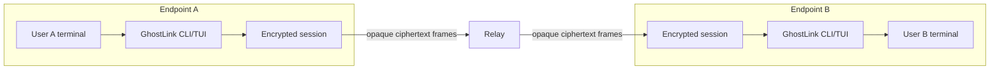
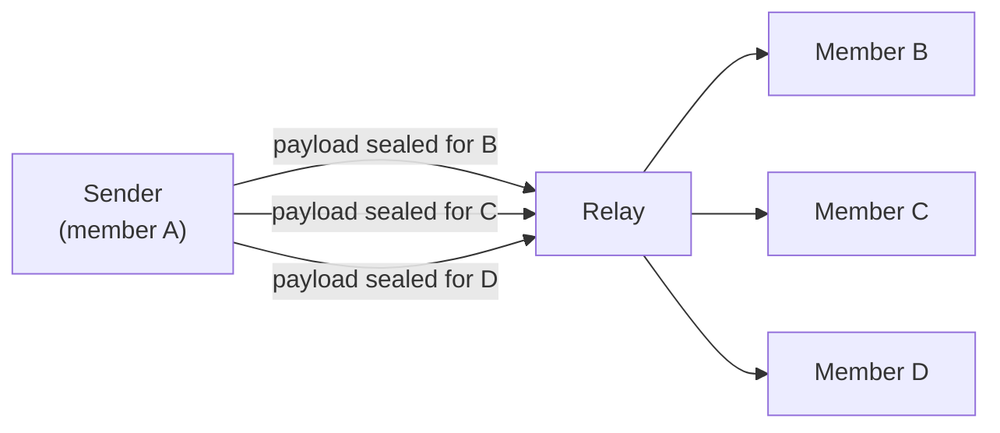

<div align="center">

# GHOSTLINK

**Terminal-native encrypted communication for Termux and Linux.**

Private conversations. End-to-end encryption. No browser required.

[](https://www.python.org/)
[](https://termux.dev/)
[](docs/ROADMAP.md)
[](docs/DEVELOPMENT.md)
[](LICENSE)


</div>

---

## Contents

[Design principle](#design-principle) · [What is GhostLink?](#what-is-ghostlink) ·
[Architecture](#architecture-overview) · [Current release](#current-release-phase-12) ·
[Screenshots](#screenshots) · [Feature matrix](#feature-matrix) ·
[Security model](#security-model) · [What the relay can see](#what-the-relay-can-see) ·
[Identity & invites](#identity-and-invites) · [File transfer](#file-transfer) ·
[Group messaging](#group-messaging) · [Installation](#installation-termux) ·
[First run](#first-run) · [CLI reference](#cli-reference) ·
[Chat commands](#terminal-chat-commands) · [Project structure](#project-structure) ·
[Development](#development) · [Testing](#testing) · [Roadmap](#roadmap) ·
[Security disclaimer](#security-disclaimer) · [Responsible use](#responsible-use) ·
[License](#license)

---

## Design principle

<div align="center">

**The terminal is the interface.<br/>
The cryptographic session is the security boundary.**

</div>

GhostLink has no GUI layer, no web client, and no background service. Every
capability is reachable from a terminal, and every security property is
defined by the cryptographic session between endpoints — not by trusting the
infrastructure that routes traffic between them.

---

## What is GhostLink?

GhostLink is a **terminal-only encrypted communication platform** written in
Python, designed primarily for **Termux on Android** with first-class support
for **desktop Linux**. Everything runs as a single CLI/TUI process: launch
it, talk, transfer, and exit. Nothing keeps running after you quit.

GhostLink provides:

- **Encrypted one-to-one conversations** with identity-bound sessions
- **Ephemeral identities** — local Ed25519 keypairs, no accounts
- **One-time invites** enforced by the relay authority
- **Encrypted file transfer** with integrity verification and resume
- **Encrypted group conversations** (up to 8 members) with pairwise-mesh
  encryption and opt-in O(1) sender-key encryption
- **Terminal-native controls** — menus, chat commands, live dashboards
- **Relay-based rendezvous** — a reference relay ships with the project

GhostLink does **not** require — and deliberately is not:

| Not required | Not part of the project |
| --- | --- |
| an Android APK | a GUI application |
| Android Studio | a browser client |
| Flutter | an Electron application |
| a phone number | a web application |
| an email address | a background daemon |
| a permanent account | a phone/email-based messenger |

---

## Architecture overview

Two endpoints run GhostLink; a relay routes opaque frames between them.
Encryption happens **at the endpoints** — the relay receives ciphertext only.



For groups, the sender encrypts **once per recipient** (pairwise fanout) and
the relay forwards each sealed payload independently:



Key properties:

- The **relay routes traffic**; it does not receive plaintext, keys, message
  ids, or sequence numbers.
- **Encryption is performed at the endpoints** (X25519 + HKDF-SHA256 +
  ChaCha20-Poly1305), and keys never leave them.
- **Group messages use pairwise fanout**: each authorized recipient receives
  an independently sealed ciphertext. Groups are capped at **8 members**, so
  a message is encrypted at most 7 times.
- The relay sees connection metadata, including IP addresses. **GhostLink
  does not claim the relay hides IP addresses.**

Layers, bootstrap, async model, and error taxonomy are documented in
[docs/ARCHITECTURE.md](docs/ARCHITECTURE.md); the group security design
lives in [docs/GROUPS.md](docs/GROUPS.md).

---

## Current release: Phase 14

**Phase 14 — Public Production Launch & Reliability** is the latest implemented
phase (version `0.16.0`).

- **Production environment model** — explicit `development`/`staging`/
  `production` with fail-closed validation (production rejects SQLite, memory
  rate limiting, insecure cookies, wildcard hosts, dev email/secret, and
  non-HTTPS `PUBLIC_BASE_URL`). Templates in `deployment/env/`.
- **PostgreSQL production path** — `DB_POOL_*`/`DB_*` timeouts,
  `BACKUP_ENCRYPTION_KEY`, `EMAIL_SMTP_USERNAME`; fail-closed production config.
  Runtime PostgreSQL integration remains environment-gated.
- **Observability** — structured logs now carry `event`, `environment`, and
  `error_class`, plus startup/shutdown lifecycle events.
- **Termux reliability** — the developer client fails closed on malformed
  responses and surfaces clear errors for 401/429/500/503 and network failures.
- **Owner invariant** — permanent `TestSingleOwnerInvariant` regression suite.
- **Security tooling & docs** — extended audit (`scripts/security_check.py`),
  `docs/INCIDENT_RESPONSE.md`, `docs/PRODUCTION_RUNBOOK.md`, `docs/RELEASE.md`,
  `docs/TERMUX.md`, `CHANGELOG.md`.
- **Frontend quality** — loading/empty/error states with accessible
  `role=status`/`role=alert`, reduced-motion support.

Phase 13 (Production Infrastructure & Deployment Hardening, `0.15.0`) is fully
retained and described below.

## Phase 13 — Production Infrastructure, Database & Deployment Hardening

**Phase 13 — Production Infrastructure, Database & Deployment Hardening** is
the previous implemented phase (version `0.15.0`).

- **PostgreSQL backend** — a first-class PostgreSQL persistence layer
  (connection pooling, timeouts, transaction safety, numbered + checksummed
  migrations with advisory-lock serialisation and future-version rejection)
  while SQLite remains the default for local development and Termux. See
  [docs/DATABASE_PRODUCTION.md](docs/DATABASE_PRODUCTION.md) and
  [docs/MIGRATIONS.md](docs/MIGRATIONS.md).
- **Distributed rate limiting** — a `RateLimiter` interface with an in-memory
  and a PostgreSQL backend; multi-process PostgreSQL deployments fail closed
  rather than silently degrading to per-process limits. See
  [docs/RATE_LIMITING.md](docs/RATE_LIMITING.md).
- **Production HTTP/deployment** — gunicorn + reverse-proxy configuration,
  HTTPS/HSTS/security headers, trusted-proxy & Host validation, containerised
  and systemd deployment, health/readiness/liveness endpoints, structured
  JSON observability with request correlation and secret scrubbing, encrypted
  checksummed backups, and bounded data retention. See
  [docs/DEPLOYMENT.md](docs/DEPLOYMENT.md), [docs/OBSERVABILITY.md](docs/OBSERVABILITY.md),
  [docs/BACKUPS.md](docs/BACKUPS.md) and [docs/OPERATIONS.md](docs/OPERATIONS.md).
- **CI/CD & supply-chain** — pytest/ruff/mypy/compileall/frontend gates plus
  PostgreSQL integration, Docker build, secret scan, and a manual-approval
  release workflow. See [docs/CI_CD.md](docs/CI_CD.md).
- **Owner rule retained** — exactly one Owner; developer accounts can never
  become Owner or transfer ownership (enforced by `tests/test_phase13_security.py`).

Phase 12 (Developer API Platform & Termux Integration, `0.14.0`) is fully
retained and documented below:

- **Developer API** (`/api/v1/developer/*`) — a narrowly scoped, authenticated,
  auditable, revocable developer API with least-privilege scopes,
  short-lived bearer access + rotating refresh tokens, cryptographically
  random device identity, secure short-lived pairing, server-side project
  binding, and persistent credential/device revocation.
- **Termux CLI** — `ghostlink developer login/logout/whoami/device/project/
  credential/security-status/doctor`, backed by a 0600 local token store.
- **Owner rule** — exactly one Owner; developer accounts can never become
  Owner or transfer ownership.
- **Production configuration** — an environment-driven, fail-closed config
  layer (`APP_ENV` = development/staging/production; production rejects
  development conveniences and requires `SESSION_SECRET`, `DATABASE_URL`,
  `EMAIL_*`, and `WEBAUTHN_*`). See
  [docs/PRODUCTION_CONFIG.md](docs/PRODUCTION_CONFIG.md).
- **Database** — a versioned, transactional migration system with indexes,
  foreign-key and uniqueness enforcement, and future-schema fail-closed.
  See [docs/DATABASE.md](docs/DATABASE.md).
- **Authentication & session hardening** — idle + absolute session
  lifetime, session rotation, password-change session invalidation,
  revoke-all. See [docs/DEVELOPER_PORTAL.md](docs/DEVELOPER_PORTAL.md).
- **WebAuthn hardening** — single-use/expiring challenges and origin
  validation (no biometric data ever collected or stored).
- **Email abstraction** — a provider interface (dev adapter + SMTP).
- **Security tooling** — a deterministic audit
  (`scripts/security_check.sh`) and metadata-only operational logging.
- **Testing** — expanded E2E and failure/recovery coverage (74 portal
  backend tests).

Phase 10B's portal and Phase 10A's **local** Developer Account system are
fully retained. All of Phases 1–9 remain fully intact, including sender-key
encryption and
the reliability/release hardening. Run `ghostlink security-status` for a
read-only security & recovery summary and `ghostlink --doctor` to verify
the environment.

- Group messaging is implemented on top of the Phase 6B group lifecycle.
- Two encryption suites, chosen at group creation:
  - **`mesh-v1`** (default, backward compatible): every recipient receives
    an **independently sealed ciphertext** — there is **no shared group
    key**.
  - **`senderkey-v1`** (opt-in): each sender seals each message **once**
    (O(1)) with a per-sender, epoch-scoped hash-ratchet chain, broadcast to
    the whole roster. Sender keys are distributed over the authenticated
    pairwise mesh and rotated on every membership change.
- Encryption reuses the existing Phase 3 primitives verbatim: **X25519** key
  agreement, **HKDF-SHA256** derivation, **ChaCha20-Poly1305** AEAD. No new
  primitives or libraries were introduced.
- Pairwise group links are **epoch-bound** and identity-bound; membership is
  controlled by **signed roster events**, and roster epochs increment on
  every membership change.
- The relay forwards opaque `GROUP_FORWARD` envelopes only — it validates
  framing and roster ACLs, never content (no sender keys, message keys, or
  plaintext).
- Groups are limited to **8 members**. Sender keys give O(1) per-message
  encryption; `mesh-v1` keeps per-recipient fanout for full backward
  compatibility.

Create a sender-key group with
`ghostlink group create --name Team --crypto-suite senderkey-v1`. In-group,
`/security` shows the active suite, epoch, and key state — never the keys
themselves.

---

## Screenshots

Every image below is generated from the **live application** by
`scripts/generate_screenshots.py` — real handshakes, real frames, real
transfers over an in-process relay. Nothing is mocked or hand-drawn.

### Terminal interface

<div align="center">

</div>

### Secure messaging

| Encrypted chat (real scripted session) | Relay dashboard (real probe) |
| :---: | :---: |
|  |  |

### Secure transfers

| File transfer (real scripted transfer) | One-time invite (real redemption) |
| :---: | :---: |
|  |  |

### Group messaging

The group chat surface (`ghostlink group chat gl-group-…`) ships in Phase 6C.
No screenshot of it is published yet — images in this README are only added
when they can be generated from the real application.

---

## Feature matrix

| Capability | Status |
| --- | :---: |
| Terminal-only UI | ✅ |
| Termux support | ✅ |
| Linux support | ✅ |
| Encrypted one-to-one messaging | ✅ |
| Ephemeral identities | ✅ |
| One-time invites | ✅ |
| Encrypted file transfer | ✅ |
| Resumable transfers | ✅ |
| Group lifecycle (create/join/leave/remove/dissolve) | ✅ |
| Group messaging | ✅ |
| Pairwise-mesh group encryption | ✅ |
| Sender-key group encryption (O(1), opt-in) | ✅ |
| Relay never sees keys or plaintext | ✅ |
| Developer account & API credentials (local, no network) | ✅ |
| Browser client | Out of scope — terminal-only by design |
| GUI / Electron application | Out of scope — terminal-only by design |
| Android APK | Not part of the project |
| Voice / video / screen sharing | Out of scope |

Statuses reflect the implemented code and the roadmap in
[docs/ROADMAP.md](docs/ROADMAP.md).

---

## Security model

**Primitives (Phase 3).** Key agreement uses ephemeral **X25519** bound to
the handshake transcript; session keys are derived with **HKDF-SHA256**;
every message, chunk, and group payload is sealed with
**ChaCha20-Poly1305**. A fresh session key is derived per conversation and
again after every reconnect. Keys live in process memory only and are
overwritten before release — they never touch disk.

**Identity (Phase 5).** Each installation holds a local ephemeral **Ed25519**
identity keypair. Public identity keys are bound into session handshakes and
group rosters; a substituted key fails the session loudly.

**Group encryption (Phase 6C).** For a group of N members, the sender creates
**independently authenticated ciphertext for each authorized recipient** over
pairwise links. Groups hold at most **8 members**, so the maximum fanout is
**7 recipient encryptions per sender message**.

Every sealed group payload is cryptographically bound to its context:

- **Group binding** — ciphertext is tied to the group id.
- **Epoch binding** — ciphertext is tied to the roster epoch; old-epoch
  traffic drains within a bounded window, then fails.
- **Sender binding** — payloads authenticate the sending identity.
- **Recipient binding** — a payload sealed for one member cannot
  authenticate for another.
- **AEAD authentication** — tampering, truncation, and forgery fail
  decryption; failures are never silent.
- **Replay protection** — message-id LRU deduplication plus bounded
  sequence cursors; duplicates are re-acknowledged, never re-delivered.
- **Roster authorization** — only active members of the current epoch may
  send; membership changes commit only with valid signatures.

**What the security model does not provide.** GhostLink makes no claims of
anonymity, untraceability, IP hiding, or protection against traffic
analysis. It does not protect you from a compromised endpoint, and it does
not make you invisible to network observers.

> **The relay is not an anonymity network.**

---

## What the relay can see

GhostLink is explicit about the relay's visibility. Content confidentiality
is end-to-end; connection metadata is not hidden.

| The relay **can** observe | The relay **cannot** read |
| --- | --- |
| Connection metadata (who connects, when) | Plaintext messages |
| IP addresses of connecting clients | Session keys |
| Timing of traffic | Private identity keys |
| Traffic volume | File contents |
| Group / session metadata (ids, epochs, membership events) | Decrypted group messages |
| Connection state (whether a peer is connected) | Any cryptographic secret |

The relay can also refuse or delay service. From
[docs/GROUPS.md](docs/GROUPS.md) §28.5: *"The relay routes opaque ciphertext
and sees connection/group metadata. It cannot read messages or keys. It can
observe IP addresses, timing, and traffic volume, and can refuse or delay
service."* If relay metadata matters to you, run your own relay and use
`wss://` — network-level visibility is out of scope for GhostLink's design.

---

## Identity and invites

**Identity is local and ephemeral.**

- A fresh **Ed25519 keypair** is generated on your device (stored `0600`);
  the private key is never displayed, never logged, and never leaves the
  device.
- You get a short handle (e.g. `GL-7K3M`) and an optional nickname — nothing
  else. **No email, no phone number, no account.**
- Each identity has a verification fingerprint
  (`GLFP-XXXX-XXXX-XXXX`) derived from the public key. Compare fingerprints
  with your peer over a trusted out-of-band channel (`/fingerprint` inside
  the chat) for stronger authentication.

**Invites are one-time, relay-enforced tokens.**

- `ghostlink invite create` mints a CSPRNG token and prints a
  `gl://join/<token>` link; tokens are never re-displayed
  (`invite list` / `invite info` show metadata only).
- Expiration runs on the relay's monotonic clock.
- Redemption is **atomic**: two peers racing for the same invite produce
  exactly one winner.
- The creator can **revoke** an invite at any time; the relay fails closed on
  unknown, expired, revoked, or already-used tokens.

Invite links are **terminal artifacts**. They are not browser URLs — typing
one into a browser does nothing, and GhostLink never pretends otherwise.

---

## File transfer

Files travel through the same encrypted session, with their own safeguards:

- **Peer approval first** — a sealed manifest (name, size, chunk geometry,
  SHA-256 — never your local path) is offered; no bytes move before the
  receiver accepts.
- **Per-transfer encryption** — each transfer derives its own HKDF sub-key
  from the session key; every chunk is AEAD-sealed with
  `transfer_id|chunk_number` as associated data.
- **Integrity verification** — the completed file is SHA-256-checked against
  the manifest **before publication**; on mismatch the partial file is
  deleted and both sides are informed.
- **Pause / resume / cancel** — mid-flight, by either side.
- **Connection-loss recovery** — the receiver's verified-chunk bitmap drives
  the resume; verified chunks are never retransmitted.
- **Hostile filename protection** — remote names are sanitized (separators,
  unicode lookalikes, device names, length); no traversal, no absolute
  paths, no silent overwrites.
- **Bounded resources** — caps on file size, concurrency, chunk size,
  retries, expiry, and temporary storage quota.

Verified files land atomically in `~/Download/GhostLink` by default.

---

## Group messaging

Groups are private, invite-only, capped at **8 members** (the cap is enforced
by the relay authority, not the UI). The workflow:

1. The **owner creates** the group (`ghostlink group create`), proving
   possession of their identity key; the relay mints the `gl-group-…` id.
2. **Members join** through an authorized group invitation
   (`gl://join/…`, owner-minted).
3. **Signed roster events** establish membership — owner-signed
   admissions/removals/dissolutions, self-signed leaves; a candidate can
   never sign their own way in.
4. The **epoch increments** on every committed membership change; clients
   cannot pick, skip, or roll back epochs.
5. The **sender encrypts** — on `mesh-v1` groups, one sealed payload per
   authorized member over identity-bound pairwise links; on `senderkey-v1`
   groups, one seal per message with an epoch-scoped sender key, broadcast
   to the roster (O(1) per message).
6. The **relay forwards opaque payloads** after framing/ACL checks.
7. Each **recipient decrypts** the message, cross-checking group, epoch,
   sender (and, on mesh, recipient) bindings.
8. **Removed members cannot participate in future epochs** — they hold no
   new-epoch links and no new-epoch sender keys; joiners gain no history.

Delivery is reported per recipient (`delivered k/m`); the interface never
claims full delivery for a partial fanout. Open the group chat with:

```bash
ghostlink group chat gl-group-XXXX-XXXX-XXXX
```

To create a group with the sender-key suite instead of the default pairwise
mesh:

```bash
ghostlink group create --name Team --crypto-suite senderkey-v1
```

Inside any group chat, `/security` shows the active suite, current epoch,
and key-state counters — never any key material.

---

## Installation: Termux

GhostLink requires **Python 3.11 or newer**.

```bash
pkg update
pkg install -y python git

git clone https://github.com/cybervault-Hacky/Ghostlink.git
cd Ghostlink

python --version          # must report 3.11+
pip install -r requirements.txt
```

Or run the idempotent bootstrap, which performs the same steps:

```bash
bash scripts/termux_setup.sh
```

Launch:

```bash
python ghostlink.py
```

Runtime dependencies are minimal: `rich` and `simple-term-menu` for the
interface, `cryptography` for the audited X25519 / ChaCha20-Poly1305 /
Ed25519 primitives. Nothing is rooted, and nothing keeps running after exit.

---

## Installation: Linux

Use your distribution's Python as long as it is **3.11 or newer**; check
first:

```bash
python3 --version         # must report 3.11+
```

Then clone and install:

```bash
git clone https://github.com/cybervault-Hacky/Ghostlink.git
cd Ghostlink

python3 -m venv .venv
source .venv/bin/activate
pip install -r requirements.txt
```

Launch:

```bash
python ghostlink.py
```

Optionally install GhostLink as a command:

```bash
pip install .             # provides the `ghostlink` command
ghostlink
```

---

## First run

A complete first conversation, step by step:

1. **Start a relay** (or use one you trust):

   ```bash
   python -m ghostlink.transport.relay.server --port 8787
   ```

2. **Create and host a room** in a second terminal:

   ```bash
   ghostlink host --relay ws://127.0.0.1:8787 --as Nova
   ```

   This prints the room id (e.g. `gl-room-ABCD-EFGH-JKMN`) and opens the
   chat. Alternatively mint a one-time invite:
   `ghostlink invite create --expires 10m --relay ws://127.0.0.1:8787`.

3. **Share the room id or invite link** with your peer through a trusted
   channel. Links are terminal artifacts — say them, message them, don't
   post them publicly.

4. **The peer joins**:

   ```bash
   ghostlink join gl-room-ABCD-EFGH-JKMN --relay ws://127.0.0.1:8787 --as Ravi
   # or, with an invite:
   ghostlink join gl://join/… --relay ws://127.0.0.1:8787
   ```

5. **Verify before you trust.** Both sides see the same safety code after the
   handshake — compare it out-of-band once. For stronger authentication,
   compare identity fingerprints with `/fingerprint`.

6. **Chat.** Type messages; `/help` lists every command.

7. **Transfer files if needed** — `/send <file>` offers an encrypted
  transfer; the peer approves it before any bytes move.

8. **Create a group if needed** — `ghostlink group create --name <name>`,
   then `ghostlink group invite` and `ghostlink group chat`.

Menu navigation: **↑/↓** or **j/k** to move, **Enter** to select, **q** to
quit. When input is piped, the menu automatically becomes a numbered prompt.

---

## CLI reference

Every command below is defined by the argument parser in
`ghostlink/cli/arguments.py`.

| Command | Description |
| --- | --- |
| `ghostlink` | Launch the interactive menu |
| `ghostlink host` | Create a room and a first invite, then display both; with `--relay` opens the encrypted chat |
| `ghostlink join <gl-room-…\|gl://join/…>` | Join a room or redeem an invite, then chat |
| `ghostlink identity` | Show your local identity (handle, fingerprint, nickname) |
| `ghostlink identity fingerprint` | Print only the identity fingerprint |
| `ghostlink identity nickname <name>` | Set the nickname your peers see |
| `ghostlink invite create` | Mint a one-time `gl://join/…` invite |
| `ghostlink invite list` | List your invites (metadata only — never tokens) |
| `ghostlink invite info <gi_…>` | Inspect one invite (metadata only) |
| `ghostlink invite revoke <gi_…>` | Revoke an invite (relay-authoritative) |
| `ghostlink group create --name <name>` | Create a group (up to 8 members) |
| `ghostlink group list` | List your groups (default group action) |
| `ghostlink group info <gl-group-…>` | Show roster, epoch, and signed events |
| `ghostlink group invite <gl-group-…>` | Mint a group invite link (owner only) |
| `ghostlink group join <gl://join/…>` | Join a group via invite |
| `ghostlink group leave <gl-group-…>` | Leave a group permanently |
| `ghostlink group remove <gl-group-…> <GLFP-…>` | Remove a member (owner only) |
| `ghostlink group dissolve <gl-group-…>` | Dissolve a group (owner only) |
| `ghostlink group sync <gl-group-…>` | Re-sync the roster from the relay |
| `ghostlink group host <gl-group-…>` | Stay online and countersign admissions (owner) |
| `ghostlink group chat <gl-group-…>` | Open the encrypted group conversation |
| `ghostlink relay-status` | Probe the relay and render the live status dashboard |
| `ghostlink session` | Session dashboard: history, rooms, invites |
| `ghostlink doctor` | Read-only environment diagnostics (dependencies, crypto, storage) |
| `ghostlink security-status` | Read-only security, crypto-suite & recovery summary |
| `ghostlink developer init` | Create a local developer account + first API key (shown once) |
| `ghostlink developer key list/rotate/revoke` | Manage developer credentials (local-only) |
| `ghostlink developer export-info` | Export public developer metadata as JSON |

Common options (where applicable): `--relay URL`, `--as NAME`,
`--expires DURATION` (`900`, `30s`, `5m`, `1h`), `--uses N`,
`--name NAME`, `--no-chat`.

Global flags:

| Flag | Effect |
| --- | --- |
| `--version` | Print the version banner and exit |
| `--config FILE` | Use an alternate configuration file |
| `--data-dir DIR` | Redirect state and logs for this run |
| `--theme NAME` | Color theme: `phantom` (default), `emerald`, `ember`, `mono` |
| `--debug` | Debug Mode: verbose logging and tracebacks |
| `--no-color` | Plain output (also honours `NO_COLOR`) |
| `--doctor` | Run diagnostics and exit (same as the `doctor` command) |

---

## Terminal chat commands

Verified against the chat surfaces in `ghostlink/ui/chat.py` and
`ghostlink/ui/group_chat.py`.

**One-to-one chat**

| Command | Description |
| --- | --- |
| `/help` | Show the command list |
| `/info` | Session, encryption, and delivery statistics |
| `/identity` | Your local identity — nickname, handle, fingerprint |
| `/fingerprint` | Peer verification fingerprints (compare out-of-band) |
| `/invite [list\|revoke <id>]` | Invite status for this chat, or manage invites |
| `/clear` | Clear the screen and redraw the banner |
| `/history` | Show messages retained this session |
| `/export [file]` | Write retained history to a plaintext file |
| `/send <file>` | Offer a file — encrypted, peer approves first |
| `/transfers` | List every transfer with live progress and state |
| `/transfer <id>` | Transfer details: progress, integrity, destination |
| `/accept [id]` | Accept the latest (or given) incoming offer — `Y` works too |
| `/reject [id]` | Decline an incoming offer — `N` works too |
| `/pause <id>` | Pause an in-flight transfer |
| `/resume <id>` | Resume a paused transfer (verified chunks are kept) |
| `/cancel <id>` | Cancel a transfer; ids may be unique prefixes |
| `/exit`, `/quit` | Close the session and leave |

A trailing `\` continues a multi-line message; **↑** recalls input history.

**Group chat**

| Command | Description |
| --- | --- |
| `/help` | Show the command list |
| `/info` | Group, epoch, encryption, and delivery statistics |
| `/members` | Roster with per-member pairwise-link state |
| `/fingerprint` | Member verification fingerprints (compare out-of-band) |
| `/delivery` | Recent per-recipient delivery states |
| `/invite` | Mint a group invite link (owner only) |
| `/leave` | Leave this group permanently |
| `/history` | Show messages retained this session |
| `/export [file]` | Write retained history to a plaintext file |
| `/quit`, `/exit` | Close the group chat |

---

## Project structure

```
Ghostlink/
├── ghostlink.py            # direct-launch entry point
├── ghostlink/              # the package
│   ├── assets/             # ASCII branding + packaged default configuration
│   ├── cli/                # argument parsing, subcommands, entry point
│   ├── config/             # TOML loading, strict validation, manager
│   ├── constants/          # metadata, file/env names — single source of truth
│   ├── core/               # environment detection, logging, bootstrap, app loop
│   ├── exceptions/         # GhostLinkError hierarchy + panel renderer
│   ├── groups/             # Phase 6B/6C: roster authority, signed events, epochs,
│   │                       #   pairwise-mesh links, sealed frames, group messaging
│   ├── identity/           # Phase 5: ephemeral Ed25519 identity (GL-…, GLFP-…)
│   ├── invites/            # Phase 5: one-time invites — tokens, relay authority,
│   │                       #   registry, redemption, terminal panels
│   ├── messaging/          # Phase 3: key exchange, AEAD frames, delivery lifecycle,
│   │                       #   chat session orchestration, history, receipts, typing
│   ├── models/             # frozen data models (environment, room, invite, settings)
│   ├── services/           # DI container, session lifecycle, rooms & invites
│   ├── storage/            # atomic JSON + in-memory backends, storage manager
│   ├── transfer/           # Phase 4: encrypted file transfer — manifests, chunking,
│   │                       #   integrity, resume, sanitized storage, progress
│   ├── transport/          # Transport ABC, connection state machine, heartbeat,
│   │                       #   RFC 6455 WebSocket, relay protocol v4 (client/server)
│   ├── ui/                 # console, themes, menu, chat surfaces, components,
│   │                       #   screens, dashboards, charts
│   └── utils/              # XDG paths, text helpers
├── docs/                   # ARCHITECTURE · CONFIGURATION · DEVELOPMENT · GROUPS · ROADMAP
├── scripts/                # dev_check.sh · generate_screenshots.py · termux_setup.sh · run.sh
└── tests/                  # pytest suite — 1283 passing tests
```

---

## Development

GhostLink targets **Python 3.11+** (see
[docs/COMPATIBILITY.md](docs/COMPATIBILITY.md) for the exact matrix).
Developer setup:

```bash
git clone https://github.com/cybervault-Hacky/Ghostlink.git
cd Ghostlink
python3 -m venv .venv && source .venv/bin/activate
pip install -e ".[dev]"        # pytest, ruff, mypy
```

The full quality gate is `scripts/dev_check.sh`, which runs — in order —
byte-compilation (`compileall`), **Ruff** lint, **Ruff** format
verification, **mypy --strict**, the **pytest** suite, and `--version` /
`--doctor` smoke checks:

```bash
scripts/dev_check.sh
```

Individual checks:

```bash
pytest tests/                  # test suite
ruff check ghostlink tests ghostlink.py
ruff format --check ghostlink tests ghostlink.py
mypy --config-file pyproject.toml
python -m compileall -q ghostlink tests ghostlink.py
```

Regenerate the documentation screenshots from the live application:

```bash
python scripts/generate_screenshots.py
```

| Document | Contents |
| --- | --- |
| [docs/ARCHITECTURE.md](docs/ARCHITECTURE.md) | Layers, bootstrap, async model, error taxonomy |
| [docs/CONFIGURATION.md](docs/CONFIGURATION.md) | Every configuration key and precedence rule |
| [docs/DEVELOPMENT.md](docs/DEVELOPMENT.md) | Dev setup, quality gate, contribution patterns |
| [docs/GROUPS.md](docs/GROUPS.md) | Group security design and implementation notes |
| [docs/ROADMAP.md](docs/ROADMAP.md) | Phase plan and explicit non-goals |

---

## Testing

The suite currently reports **1283 passed, 1 skipped** (verified
2026-08-08). Run it with:

```bash
pytest tests/
```

Coverage spans the whole stack, including:

- **Crypto** — key exchange, HKDF derivation, AEAD sealing, context binding
- **Messaging** — session lifecycle, delivery states, ordering, receipts, typing
- **Transport** — RFC 6455 framing, loopback, connection state machine, heartbeats
- **Relay** — server, client, endpoint, routing, protocol versions
- **Invites** — tokens, expiration, atomic redemption, relay authority, e2e
- **Identity** — keypairs, fingerprints, nicknames, chat binding
- **Transfers** — manifests, chunking, integrity, resume, storage hygiene
- **Groups** — ids, events, frames, authority, registry, mesh, lifecycle,
  relay e2e, messaging e2e
- **CLI** — argument parsing and end-to-end command runs against a live relay
- **Security hygiene** — secret-leak audits of logs and local stores
- **Integration** — full two-party conversations, invite redemptions, file
  transfers, and eight-member group fanout over a real in-process relay

---

## Roadmap

GhostLink ships in deliberate, self-contained phases.

| Phase | Scope | Status |
| --- | --- | --- |
| 1 | Foundation — UI, configuration, environment, logging, diagnostics | ✅ Implemented |
| 2 | Secure networking — WebSocket transport, relay, rooms, invites, heartbeats | ✅ Implemented |
| 3 | Secure messaging — E2E encryption, identity-bound sessions, receipts | ✅ Implemented |
| 4 | Secure file transfer — chunking, integrity, resume, hostile-name safety | ✅ Implemented |
| 5 | Ephemeral identity & one-time invites | ✅ Implemented |
| 6A | Group security design ([docs/GROUPS.md](docs/GROUPS.md)) | ✅ Design complete |
| 6B | Group lifecycle — membership, signed roster events, epochs | ✅ Implemented |
| 6C | Group messaging + pairwise-mesh encryption | ✅ Implemented |
| 7 | Sender-key hardening — O(1) group encryption, epoch-scoped sender keys | ✅ Implemented |
| 8 | Reliability, security hardening & adversarial validation | ✅ Implemented |
| 9 | Production readiness, compatibility & release engineering | ✅ Implemented |
| 10A | Developer account & credential infrastructure | ✅ Implemented |
| 10B | Developer portal (web) | ✅ Implemented |
| 11 | Production portal hardening & launch readiness | ✅ Implemented |
| 12 | Developer API platform & Termux integration | ✅ Implemented (current) |
| 6D | Rich communication — replies/edits/reactions, friend system, editable settings | Planned |
| 13 | Hardening & polish — security review, offline queue design, localization | Planned |

Sender-key encryption is implemented as the opt-in `senderkey-v1` suite
(docs/GROUPS.md §36); `mesh-v1` remains the default for full backward
compatibility. [docs/ROADMAP.md](docs/ROADMAP.md) is the authoritative
roadmap.

[docs/ROADMAP.md](docs/ROADMAP.md) is the authoritative roadmap, including
what is explicitly out of scope (GUI/web clients, federated public rooms,
voice/video).

---

## Security disclaimer

GhostLink is a security-focused open-source project. It is **not** a
guarantee of anonymity or perfect security, and it should not be treated as
one.

Real-world security depends on factors outside the protocol:

- **Endpoint integrity** — a compromised device exposes everything the app
  can access.
- **Correct configuration** — for example, `wss://` relays beyond local
  development.
- **Trusted verification** — safety codes and fingerprints only help when
  compared over a genuine out-of-band channel.
- **A secure operating environment** — OS, terminal, and storage hygiene.
- **Relay availability and honesty** — the relay can refuse or delay
  service; relay-authoritative state (invites, rosters) is volatile by
  design.
- **Implementation correctness** — bugs happen; the codebase is open for
  review and improvement.

GhostLink minimizes application-level identity (no accounts, no email, no
phone) and keeps keys off disk, but it makes no anonymity or
untraceability claims. Evaluate it against your own threat model.

---

## Responsible use

GhostLink is intended for **legitimate private communication, research,
development, and authorized security experimentation**.

Users are responsible for complying with the laws and regulations that apply
to them and for obtaining any permissions required in their environment.
This project does not provide guidance for abuse, and encryption does not
make any conduct lawful.

---

## License

GhostLink is released under the [MIT License](LICENSE).

© 2026 cybervault-Hacky
